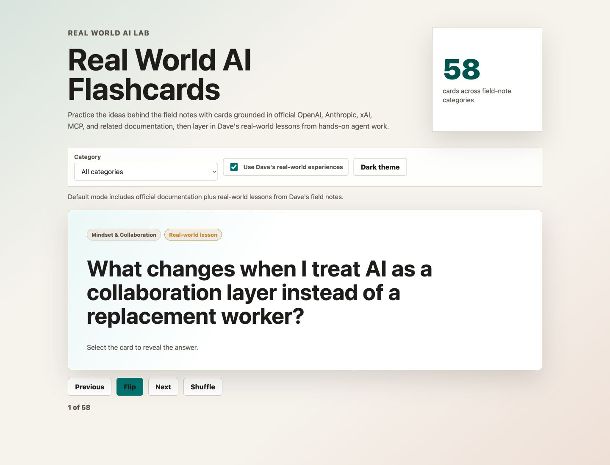
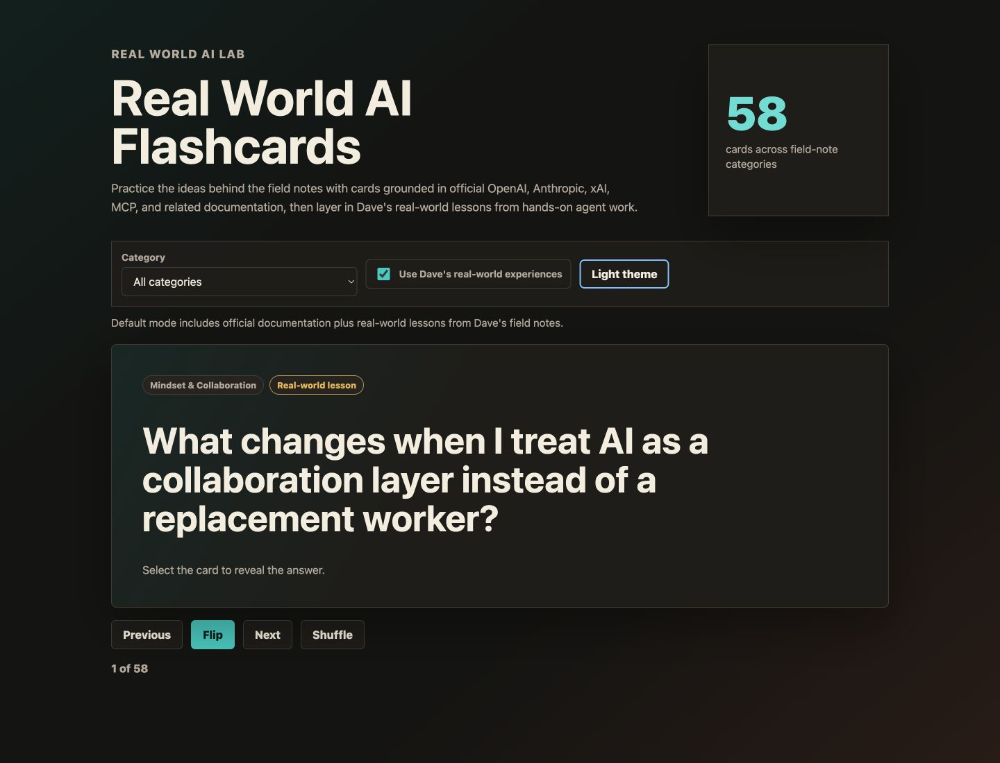

# Real World AI Lab

Notes from the trenches, practical research, and reproducible experiments for
understanding AI agents, Codex workflows, and human-AI collaboration.

This lab is a place to turn hands-on AI work into something useful for other
builders: inspectable evaluations, thoughtful notes from real workflows, and
clear ideas about where agents create value when humans, tools, and process work
together.

## Enhance your knowledge with Real World AI Flashcards

Jump straight into the core lessons with a study deck organized by the same
field-note categories. By default, the cards combine official documentation
with real-world lessons from my field notes. Turn off the real-world experience
toggle to study only cards grounded in official documentation links.

[Study the flashcards](https://disbitski.github.io/real-world-ai-lab/)

| Light theme | Dark theme |
| --- | --- |
|  |  |

## Field Notes

Short journal-style notes from hands-on AI workflow experiments:

### Agent Harness & Operating Environment

- [Custom Agent Statuslines Make The Terminal Feel Alive](field-notes/2026-06-23-custom-agent-statuslines.md)
- [The Harness Is Not The Model](field-notes/2026-06-20-agent-harnesses.md)
- [Subagents Keep The Main Thread Clean](field-notes/2026-06-25-subagents-keep-the-main-thread-clean.md)
- [Claude Code Hooks Are Local Safety Rails](field-notes/2026-06-25-claude-code-hooks-are-local-safety-rails.md)
- [MCP Is The Tool Layer](field-notes/2026-06-23-mcp-is-the-tool-layer.md)
- [When Unreal MCP Started Feeling Native](field-notes/2026-07-09-unreal-mcp-feels-native.md)
- [config.toml Is The Harness Environment](field-notes/2026-06-20-config-toml-harness-environment.md)
- [Locking Down Permissions With Codex Rules](field-notes/2026-06-20-locking-down-permissions-with-codex-rules.md)

### Building Production Apps

- [From Morrowward to MacRes4K—When AI-Built Experience Compounds](field-notes/2026-07-21-building-macres4k-with-codex.md)
- [The Loop That Built Morrowward: Delegation, Discernment, and Four Days of Human–AI Work](field-notes/2026-07-21-morrowward-delegation-discernment-loop.md)
- [OpenAI Build Week: From a QR Code to Production in Four Days](field-notes/2026-07-21-openai-build-week-four-days.md)
- [Shipping Morrowward’s AI Meant Designing Boundaries, Not Just Prompts](field-notes/2026-07-21-morrowward-ai-production-boundaries.md)

### Context & Knowledge

- [Claude Code Shortcuts Are Context Steering](field-notes/2026-06-23-claude-code-context-shortcuts.md)
- [Claude Code Memory Is A Staging Layer](field-notes/2026-06-26-claude-code-memory-is-a-staging-layer.md)
- [RAG Is Context Work](field-notes/2026-06-23-rag-is-context-work.md)
- [Reading Model Cards Without Getting Lost](field-notes/2026-06-19-model-context-output-reasoning.md)

### Creative Tools & Game Development

- [From My Amiga 500 To Blender MCP: Building Embermere's First Original Asset](field-notes/2026-07-14-amiga-blender-mcp-embermere.md)
- [From One Waystone to a World: The Acceptance Loop Behind Embermere](field-notes/2026-07-22-embermere-asset-acceptance-loop.md)

### Mindset & Collaboration

- [AI Is A Collaboration Layer, Not A Replacement Worker](field-notes/2026-06-18-human-ai-interaction.md)
- [Workflows Are Where Codex Gets Powerful](field-notes/2026-06-18-codex-workflows.md)
- [When Plan Mode Is Useful](field-notes/2026-06-20-when-plan-mode-is-useful.md)
- [Loops Are The New Prompt Surface](field-notes/2026-06-21-agentic-loops.md)
- [The Knowledge Flywheel](field-notes/2026-07-04-knowledge-flywheel.md)
- [Claude's J-Space And The Wise Old Man](field-notes/2026-07-06-claude-j-space-wise-old-man.md)

### Model Strategy & Economics

- [My Practical AI Stack: Local Models, Frontier Models, And What They Cost Me](field-notes/2026-07-12-my-practical-ai-stack.md)

### Multi-Agent & Model Collaboration

- [The Best AI Workflow May Be A Team Of Models](field-notes/2026-07-09-best-ai-workflow-team-of-models.md)

### Reusable Agent Instructions

- [AGENTS.md Is A README For Agents](field-notes/2026-06-20-agents-md-readme-for-agents.md)
- [Skill Discovery Is Part Of The Workflow](field-notes/2026-06-19-codex-skill-discovery.md)

### Societal Impacts

- [The 4D Framework Is A Common Language For AI Collaboration](field-notes/2026-06-28-4d-framework-common-language.md)
- [Teaching AI Fluency Feels Like Classical Learning For The AI Era](field-notes/2026-06-29-teaching-ai-fluency-classical-learning.md)
