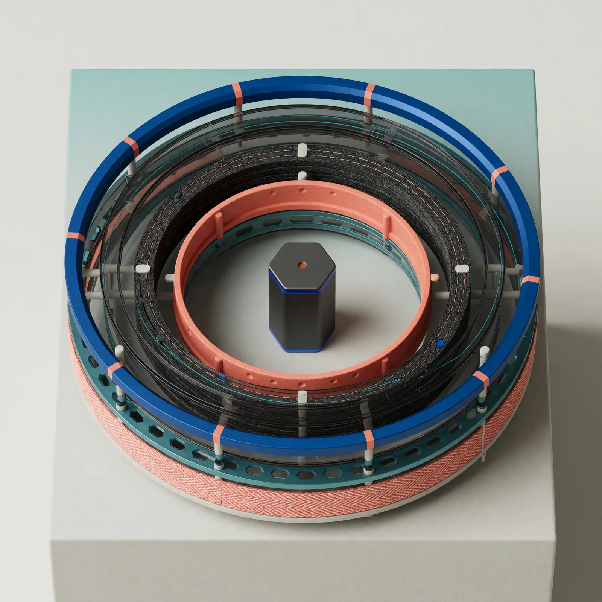

# Field Note: The Harness Is Not The Model

Date: 2026-06-20

## Summary

Two products can use the same underlying model and still feel radically
different. One may look like a chat box that answers well when the prompt is
clear. The other may feel like a capable agent that gathers context, calls
tools, checks work, preserves state, asks for approval, and produces an
artifact a human can trust.

The difference is often the harness: the system layer around the model that
turns model outputs into useful, constrained, observable action.

This is why teams should be careful when they say "the model is good" or "the
model failed." In an agentic product, performance is usually a property of the
model plus the harness plus the task environment.

## Observation

A useful pattern showed up in conversation this week: the same model can sit
inside two products, but one product can deliver much better results because it
wraps the model in a stronger execution system.

That system may include:

- context construction and retrieval
- instructions and prompt templates
- tool definitions and tool routing
- sandboxed execution environments
- approval gates and permission boundaries
- state, memory, and continuation logic
- retry and recovery behavior
- tracing, logging, and evaluation loops
- user interface choices that shape how work is reviewed

The model still matters. A weak model inside a strong harness will hit limits.
But the model is not the whole product. A strong harness can expose the model's
capabilities at the right moment, constrain risky action, recover from tool
feedback, and keep the work legible to humans.

## Why It Matters

Agent evaluation gets muddy when we attribute every outcome to the base model.
If one agent succeeds because it had better repo context, safer shell access,
clearer tool schemas, resumable state, and a better review surface, that is not
just "model intelligence." It is system design.

This matters for builders because a model upgrade may not fix a harness problem.
If the agent loses context, calls the wrong tool, ignores command output,
forgets prior state, or cannot show its work, the next model may only make the
same failure more eloquent.

It matters for buyers and teams because product comparisons should ask what the
system can do around the model:

- What tools can it call?
- What context does it load?
- What actions are sandboxed?
- What requires approval?
- What state persists across turns?
- What traces can humans inspect?
- How are failures detected and repaired?

Those questions often explain why two products with similar model access do not
feel equally capable.

## What A Harness Does

An agent harness is the operating layer that mediates between a model and the
outside world. It decides what the model sees, what actions it can request, how
those actions execute, and how the results flow back into the next step.

OpenAI's current agent docs point in this same direction. The Agents SDK guide
describes agents as applications that plan, call tools, collaborate across
specialists, and keep enough state to complete multi-step work. It also
separates cases where the Responses API is enough from cases where the
application owns orchestration, tool execution, approvals, and state.

The tool docs make the same separation from another angle: tools extend model
capabilities by letting a model search the web, retrieve files, call functions,
load tool definitions, or access third-party services. Those capabilities are
not simply properties of the base model. They are configured and mediated by the
system around it.

For Codex specifically, OpenAI describes the CLI as a coding agent that can
read, change, and run code in a selected directory. That is a harnessed
experience: the model is connected to a filesystem, command execution,
permissions, approvals, and a developer-facing interface.

## A Practical Evaluation Frame

When comparing two agent products, treat the model as one row in a larger
scorecard.

| Layer | What to inspect |
| --- | --- |
| Model | reasoning quality, latency, cost, context window, multimodal support |
| Context | repo loading, retrieval, memory, instructions, compaction |
| Tools | tool coverage, schema quality, routing, MCP/connectors, shell/file access |
| Execution | sandboxing, permissions, retries, recovery, long-running tasks |
| State | session continuity, resumability, handoffs, durable memory |
| Safety | approval gates, policy checks, secrets handling, action limits |
| Observability | traces, logs, diffs, citations, test output, review surfaces |
| Evaluation | task success, process quality, cost, robustness, security violations |

The recent Harness-Bench paper gives this intuition a research shape. It
defines a harness as the system layer that manages context, tools, state,
constraints, permissions, tracing, and recovery, and reports substantial
variation across model-harness pairings. Its recommendation is the one this lab
should adopt: report agent capability at the model-plus-harness configuration
level instead of attributing it to the model alone.

## Evaluation Ideas

This lab can evaluate harness quality by holding the model fixed and varying the
surrounding system:

- Same task, same model, different tool access.
- Same task, same model, different context-loading strategy.
- Same task, same model, with and without sandboxed shell execution.
- Same task, same model, with and without approval gates.
- Same task, same model, different review surfaces or trace visibility.
- Same task, same model, different retry and recovery policies.

For each run, record:

- final artifact quality
- whether the task was completed
- tool calls and command outputs
- number of turns and tokens
- whether the agent used evidence from the workspace
- whether it respected permissions and constraints
- whether the trace is understandable enough for human review

The key is to score both outcome and process. A run that gets the right answer
by ignoring tool feedback, leaking secrets, or hiding its reasoning trail is not
the same quality of agent behavior as a run that succeeds through grounded,
auditable execution.

## Sources

- OpenAI Agents SDK guide: https://developers.openai.com/api/docs/guides/agents
- OpenAI tools guide: https://developers.openai.com/api/docs/guides/tools
- OpenAI Agents SDK reference: https://openai.github.io/openai-agents-python/
- OpenAI, "New tools for building agents": https://openai.com/index/new-tools-for-building-agents/
- OpenAI Codex CLI docs: https://developers.openai.com/codex/cli
- Harness-Bench: Measuring Harness Effects across Models in Realistic Agent Workflows: https://arxiv.org/abs/2605.27922

## Working Principle

Do not evaluate an agent by the model name alone. Evaluate the model, the
harness, and the workflow evidence together.
