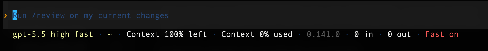
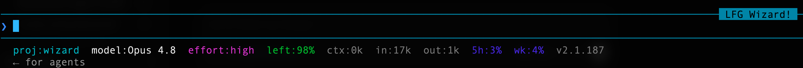

# Field Note: Custom Agent Statuslines Make The Terminal Feel Alive

Date: 2026-06-23

## Summary

I care a lot about terminal environments. Color palettes, fonts, spacing, and
the information on the command line all change how a tool feels to use.

That started mattering even more with coding agents. Claude Code and Codex are
not just commands I run once. They are workspaces I sit inside for long coding
sessions. If the statusline is bland, noisy, or missing the numbers I care
about, the tool feels less like part of my setup.

So I started customizing agent statuslines the same way I customize my shell
prompt. The lesson was simple: the agent harness is also an interface, and the
interface affects flow.

## Observation

My goal was not decoration for its own sake. I wanted a compact visual surface
that showed the state I actually use while working:

- active project
- active model
- reasoning effort
- context remaining
- current context size
- input and output tokens
- rate-limit usage
- tool or CLI version
- fast mode or speed signal

The Claude Code version became a small shell script. Claude Code now documents
`/statusline` for generating or removing a custom statusline, and the underlying
model is still command-based: it runs a configured command, sends JSON on stdin,
and displays whatever the script prints. I had Claude help customize its own
interface, which was a nice example of an agent improving the harness around
itself.

The Codex version felt more direct. Codex exposes `/statusline` as a built-in
CLI command for choosing and reordering footer fields, and it persists the
selection in `config.toml`. That made the configuration path simpler when the
goal was selecting built-in footer attributes rather than writing a custom
script.

## Visual Examples

Here is the Codex-style footer I built around a black terminal, cyan framing,
and compact status attributes:



Here is the Claude Code shell-script statusline with project, model, effort,
context, token, rate-limit, and version segments:



The two screenshots have different personalities, but the underlying pattern is
the same. I want the terminal to show the state of the work without making me
ask for it.

## Why It Matters

Good statuslines reduce context switching.

When I can see context remaining, model, effort, and usage at a glance, I do not
need to stop the workflow to ask "what mode am I in?" or "how close am I to a
context limit?" The interface keeps the important state in peripheral vision.

This is especially useful for agent work because the invisible state matters:

- A model or effort change can alter behavior.
- Context pressure can explain why an agent starts losing detail.
- Rate-limit pressure can affect when I choose a smaller task.
- Project identity matters when I have multiple terminal sessions open.
- Version information helps debug whether a feature exists in this install.

The terminal is not just aesthetics. It is operational awareness.

## Two Customization Paths

Claude Code and Codex currently expose statusline customization differently.

| Tool | Path I used | Best fit |
| --- | --- | --- |
| Claude Code | `statusLine` command in `~/.claude/settings.json` pointing at a script | Fully custom output, colors, calculations, and multi-field formatting |
| Codex CLI | `/statusline` picker persisted to `config.toml` | Fast built-in footer customization without writing a script |

For Claude Code, the core shape is:

```json
{
  "statusLine": {
    "type": "command",
    "command": "bash ~/.claude/statusline-command.sh"
  }
}
```

That command receives JSON on stdin and prints whatever should appear in the
statusline. A tiny shell script can become a personalized dashboard.

For Codex, the built-in flow is:

```text
/statusline
```

Then I can pick the footer items I care about and reorder them. The underlying
configuration is an ordered `status_line` list in `config.toml`.

```toml
[tui]
status_line = ["model", "context-remaining", "git-branch"]
```

The right choice depends on what I am trying to customize. If I want arbitrary
computed output, a script is the flexible path. If I want the official Codex
footer fields arranged my way, the built-in picker is faster and less brittle.

## What The Claude Script Shows

The Claude Code script I built displays:

| Segment | Purpose |
| --- | --- |
| `proj:` | The project or current directory name |
| `model:` | The active model display name |
| `effort:` | The current reasoning effort level |
| `left:` | Context window remaining, color-coded by risk |
| `ctx:` | Current context size |
| `in:` and `out:` | Token usage |
| `5h:` and `wk:` | Rate-limit usage windows |
| `v` | Claude Code version |

That is the practical layer I want during real work. It tells me where I am,
what kind of agent session I am in, and how much room I have left.

## Try The Claude Code Statusline

I published the Claude Code version as a small public utility repo:

- [claude-code-statusline](https://github.com/disbitski/claude-code-statusline)

The repo includes the shell script, screenshot, install steps, sample JSON input
for local testing, and customization notes. If someone wants to try the same
style of statusline, they can copy the script into `~/.claude/`, add the
`statusLine` block to `~/.claude/settings.json`, and test the output before
restarting Claude Code.

That turns the field note from an observation into a reusable workflow: read
the idea, inspect the screenshot, then jump straight to a working
implementation.

## Evaluation Ideas

This lab can evaluate custom statuslines as part of the agent harness:

- Does the statusline show state that changes real decisions?
- Does it reduce how often I ask the agent for session status?
- Does it help detect context pressure before quality drops?
- Does the color palette make risk states visible without being distracting?
- Does the statusline stay readable in small terminal windows?
- Does it work across new sessions without manual setup?
- Does it fail gracefully when fields are missing?
- Does it make multiple agent terminals easier to distinguish?

For a practical test, I would compare two weeks of work with the default
statusline and two weeks with the custom one. The score should include task
flow, number of status checks, context-limit surprises, and whether I kept the
terminal open longer because it felt better to use.

## Sources

- My Claude Code and Codex statusline screenshots, 2026-06-23.
- My Claude Code `statusline-command.sh` and setup README, 2026-06-23.
- Anthropic Claude Code, "Customize your status line": https://code.claude.com/docs/en/statusline
- OpenAI Codex manual, "Slash commands in Codex CLI" and `status_line` config reference, fetched 2026-06-23.

## Working Principle

If I am going to live inside an agent terminal, the terminal should tell me the
state of the agent, the work, and the limits without breaking my flow.
