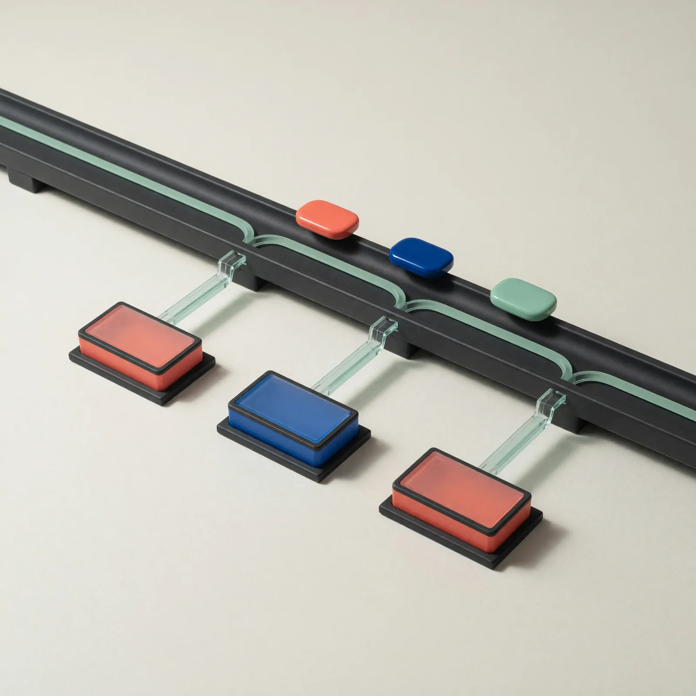

# Field Note: Subagents Keep The Main Thread Clean

Date: 2026-06-25



## Summary

I have been using Claude subagents as a way to answer specific questions
without disturbing the main conversation I am having with Claude. That has
turned out to be more useful than I expected.

The pattern is simple: when I need focused research, noisy inspection, or a
second opinion, I can send that work into a smaller side context and get back
the distilled result. The main thread stays centered on the actual decision I
am trying to make.

I have used this for practical things like researching proper form, checking
financial technical analysis, and separating supporting research from the
conversation where I am making the judgment call. The subagent is not a magic
authority. It is a context boundary.

## Observation

The useful feeling is that I can keep the main conversation clean while still
letting the agent do deeper work.

If I ask the main thread to research every supporting question directly, the
conversation fills with raw notes, half-relevant sources, tool output, charts,
logs, and intermediate reasoning. Some of that is useful in the moment, but it
does not all deserve to live beside my actual goal.

Subagents give me a cleaner workflow:

- the main thread holds the goal, constraints, and decisions
- the subagent handles bounded research or inspection
- the subagent returns only the summary, evidence, and caveats I need
- I decide what to carry forward

That matters when the side task is real work but not the main work. Proper form
research can involve comparing technique cues and spotting contradictions.
Financial technical analysis can involve looking across indicators,
timeframes, and scenarios. In both cases, I do not want every exploratory note
to crowd the main context. I want the result, the evidence, and the uncertainty.

## Why It Matters

Subagents are one of the clearest examples of the harness being more than the
model. The base model matters, but the workflow changes when the system can
split work into separate contexts, apply different instructions, limit tools,
and return a compressed answer to the main thread.

That makes subagents useful for three reasons.

First, they protect attention. The main thread is where I keep the problem
statement, my preferences, the reader, the tradeoffs, and the final decision.
If that thread gets buried under research exhaust, the agent becomes harder to
steer.

Second, they create specialist contracts. A subagent can be told to review for
test gaps, summarize a document, inspect a chart setup, compare official docs,
or search a repo without also trying to own the whole task.

Third, they make parallel work safer to reason about. I can ask one subagent to
research one dimension and another to research a different dimension, then have
the main agent synthesize the results. That is stronger than asking one long
conversation to hold every branch at once.

The trap is using subagents because they feel advanced. They cost more tokens,
they can multiply weak assumptions, and they can create coordination overhead.
The move is worth it when the side work is bounded, noisy, independent, or
specialized enough that keeping it separate improves the final decision.

## How The Providers Frame It

Anthropic's Claude Code docs describe subagents almost exactly the way I have
been using them: use one when a side task would flood the main conversation
with search results, logs, file contents, or other material I will not need
again. Each subagent can have its own context window, system prompt, tools, and
permissions. Claude Code also documents common patterns like isolating
high-volume operations, running parallel research, chaining subagents, and
choosing when to keep work in the main conversation instead.

OpenAI's Codex docs make the same design point from a Codex angle. Codex
subagent workflows are meant for specialized agents that can explore, test,
triage, analyze logs, or summarize in parallel, then return distilled results.
The docs warn that Codex only spawns subagents when explicitly asked and that
each subagent does its own model and tool work, so the cost is higher than a
single-agent run. OpenAI's Agents SDK docs describe a related architecture:
handoffs when a specialist should take over, and "agents as tools" when a
manager agent should stay responsible for the final answer while calling
specialists as bounded helpers.

xAI's docs show the same idea from a research-product angle. Grok's
multi-agent research model is currently beta and is designed to coordinate
multiple agents for deep, multi-step research. xAI describes specialized
agents that search, analyze, cross-reference, synthesize, and iterate, with a
leader agent responsible for the final answer. The docs also expose the cost
tradeoff directly: more agents can mean deeper research, but also more token
usage, tool calls, and latency.

The common thread is not that every product implements subagents the same way.
The common thread is that modern agent workflows separate roles, isolate noisy
work, route tools carefully, and return summarized evidence to the place where
the final decision is made.

## A Small Subagent Pattern

For repeated work, I want subagents to have a narrow job, limited tools, and a
clear output contract. A Claude Code subagent file can make that durable:

```md
---
name: technical-analysis-researcher
description: Researches market technical-analysis setups and returns evidence, caveats, and risk notes without making trading decisions.
tools: WebSearch, Read
model: sonnet
---

You are a research subagent for financial technical analysis.

Your job:
- Compare the requested indicator setup across multiple timeframes.
- Identify bullish, bearish, and invalidation scenarios.
- Separate observed chart facts from interpretation.
- Call out uncertainty, missing data, and conflicting signals.
- Never recommend a trade, position size, or financial action.

Return:
1. Setup summary
2. Evidence observed
3. Conflicting signals
4. Risk and invalidation notes
5. Questions the main thread should decide
```

That is the shape I like: the subagent gathers and compresses; the main
conversation decides. For proper form research, the same pattern would swap in
movement cues, source quality, contraindications, and questions to ask a coach
or clinician.

## When I Should Use One

I should reach for a subagent when at least one of these is true:

- The work will produce a lot of intermediate output.
- The side task has a different role than the main task.
- The task can be done independently and summarized.
- I want a reviewer or specialist to challenge the main answer.
- The subagent can use narrower tools or permissions than the main thread.
- Parallel research will save time without creating merge conflicts.

I should keep the work in the main thread when the next step is small, the
decision is highly subjective, the context is already compact, or splitting the
work would make me reconcile more summaries than the task is worth.

## Evaluation Ideas

This lab can evaluate subagent workflows by comparing the same task with and
without delegated side contexts:

- Did the main thread stay focused on the goal and decision?
- Did the subagent return a useful summary instead of raw exploration?
- Was the subagent's role narrow enough to avoid drifting?
- Did the output include evidence, caveats, and what remains undecided?
- Did parallel research reduce elapsed time without reducing quality?
- Did the workflow avoid duplicating work across agents?
- Were permissions and tools smaller than the main thread when appropriate?
- Was the extra token cost justified by better accuracy, speed, or clarity?

For financial or health-adjacent research, I should also score whether the
subagent avoided overconfident advice and kept the final judgment with me or a
qualified human.

## Sources

- My Claude subagent workflow notes on proper form research and financial technical analysis, 2026-06-25.
- Anthropic Claude Code, "Create custom subagents": https://code.claude.com/docs/en/sub-agents
- OpenAI Codex, "Subagent concepts": https://developers.openai.com/codex/concepts/subagents
- OpenAI Codex, "Subagents": https://developers.openai.com/codex/subagents
- OpenAI Agents SDK, "Orchestration and handoffs": https://developers.openai.com/api/docs/guides/agents/orchestration
- OpenAI Agents SDK, "Running agents": https://developers.openai.com/api/docs/guides/agents/running-agents
- xAI Docs, "Multi Agent": https://docs.x.ai/developers/model-capabilities/text/multi-agent
- xAI Docs, "Function Calling": https://docs.x.ai/developers/tools/function-calling
- xAI Docs, "Context Compaction": https://docs.x.ai/developers/advanced-api-usage/context-compaction

## Working Principle

I should use subagents when I want focused side work without letting the side
work take over the main conversation.
