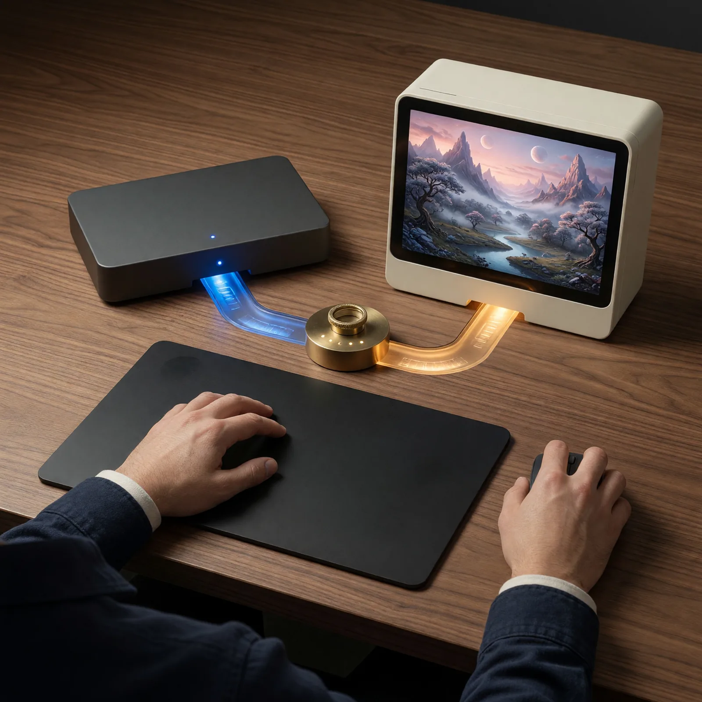

# Field Note: The Best AI Workflow May Be A Team Of Models

Date: 2026-07-09



## Summary

This field note started because I was not happy with our images.

The first generation of Real World AI Lab social heroes helped us establish a
visual language, but too many of them looked like image generation from a few
years ago. Some had ghost fingers, ambiguous hands, extra limbs, invented text,
or polished surfaces that did not quite communicate the field note underneath.

I already had an xAI developer account, API credits, and good experiences using
Grok Imagine from shell scripts. So instead of asking one AI system to keep doing
every part of the job, we built a small team.

In this session, ChatGPT Codex, with the `GPT-5.6 SOL` model label visible in my
environment, handled research, planning, API integration, prompt development,
candidate review, repository updates, testing, and delivery. Grok Imagine Image
Quality specialized in generating the visual candidates. I set the direction,
judged the comparisons, changed the rules when needed, and approved what moved
forward.

That distinction matters. `GPT-5.6 SOL` describes the model label I observed in
this session; I am not using it to make a claim about public model availability
or undocumented specifications.

The result was not one model replacing another. It was a human-directed,
multi-model workflow in which each system did the part it was best positioned
to do.

## Observation

My first instinct was simple: connect Codex to the xAI image API and see whether
Grok could make better heroes.

The useful part was everything that happened after the first API call.

Codex read the xAI documentation, learned the image endpoint, found the quality
model and 2K controls, and built a dependency-free Python generator around the
`XAI_API_KEY` environment variable. The key stayed out of prompts, logs,
metadata, and Git. The script requested four candidates at a time and preserved
the image format returned by the API.

Then we tested two social posts scheduled for the next day. I reviewed the old
heroes beside the strongest new candidates. I asked to see how Grok handled
people. I asked to see how it handled Embermere because I loved the visual of us
building the game together.

The difference was immediate. The new images felt more contemporary, more
physical, and more connected to the ideas in the notes.

But they were not automatically perfect.

One prompt produced too many hands. Another created tiny fake writing. Familiar
objects such as compasses and gauges invited unwanted numbers and markings. A
workflow scene duplicated the same artifact at several stages because the still
image was trying to show time passing.

That is when the experiment became a workflow.

We did not just keep generating. Codex inspected every candidate at original
resolution, counted people and limbs, checked cables and object topology, looked
for gibberish text and accidental branding, and regenerated only the topics
that did not have a clean winner. Each failure became a reusable prompt lesson
inside the field-notes skill.

## Why It Matters

People often ask which AI model is best.

I am increasingly interested in a different question:

> What combination of models, agents, tools, feedback loops, and human judgment
> produces the best result for this workflow?

The answer can change by task.

Codex was valuable here because this was not only image generation. The work
crossed official documentation, API code, secret handling, prompt design,
visual inspection, 38 social draft files, two platform calendars, historical
publishing boundaries, alt text, audits, tests, skills, Git commits, and pushes.

Grok Imagine was valuable because visual generation was the specialized task
where I wanted a different quality profile.

My role was valuable because neither system owned the taste, intent, or final
decision. I knew what the field notes meant. I knew which old images still had
historical value. I decided that the Grok images should be added as alternatives
instead of replacing the originals. I could look at Embermere and say, "That
feels like us building the game."

That is more than a chain of API calls. It is collaboration architecture.

## A Small Team Of Specialized AI Systems

This is how I think about the roles we used:

| Participant | Best contribution in this workflow |
| --- | --- |
| Me | Intent, taste, schedule boundaries, lived context, and final approval |
| Codex | Research, orchestration, code, prompt iteration, visual QA, repository consistency, and verification |
| Grok Imagine | High-quality image candidates from a precise visual brief |
| Skills and repos | Durable memory for rules, prompts, tests, assets, and the next session |

I call this category **Multi-Agent & Model Collaboration** because the useful
unit is wider than a single chat. Codex is the working agent. Grok Imagine is a
specialized generative model reached through a tool. The repositories and skill
carry state forward. I direct the system and remain responsible for the output.

The handoffs are where quality can compound or collapse.

Codex had to translate the meaning of each field note into a visual brief. Grok
had to translate that brief into pixels. Codex had to inspect those pixels
against explicit criteria. I had to decide whether the result actually felt
right.

Every handoff needed context and evaluation.

## From One API Call To A Quality Loop

The core generation request was intentionally small:

```python
payload = {
    "model": "grok-imagine-image-quality",
    "prompt": prompt,
    "n": 4,
    "aspect_ratio": "1:1",
    "resolution": "2k",
    "response_format": "b64_json",
}
```

The workflow around it did the real work:

```text
field note + social copy + existing theme
    -> precise visual brief
    -> four Grok candidates
    -> original-resolution inspection
    -> select or revise prompt
    -> approved hero + visible alt text
    -> LinkedIn/X draft links
    -> structural audit + Git history
    -> better prompt guidance for next time
```

The generator is now part of the reusable field-notes skill. It defaults to
four square 2K candidates, keeps temporary work outside the repository, and
only saves a selected asset after review.

The social audit also evolved. It now verifies that an updated Grok image
exists, that its visible alt text matches frontmatter, and that LinkedIn and X
use the same asset and wording when they are supposed to share a hero. It still
allows the intentional historical split where a past LinkedIn post keeps its
original image while a future X post gets the new option.

That is the pattern I want from AI work: generation should improve the system
that evaluates the next generation.

## What The Prompt Loop Taught Me

The prompts improved because we paid attention to what failed.

Some of the most reusable lessons were:

- Ask for exact object, cable, person, head, arm, and hand counts when those
  counts matter.
- Repeat count-sensitive topology in positive and negative form: "exactly
  three and only three branches."
- Prefer physical systems and concrete materials over generic glowing AI
  interfaces.
- Remove papers, open books, interface cards, gauges, clocks, rulers, and marked
  compasses when readable text is not essential.
- Show one moment in time. Do not ask a still image to place the same object at
  several stages of a process.
- Give every visible hand one simple, unobstructed action.
- Use one primary metaphor instead of asking the image to explain the entire
  article.
- Treat negative prompting as guidance, not a guarantee. Inspection still
  decides whether an image passes.

These are not universal laws of image generation. They are working knowledge
earned from this particular model, visual style, and publishing workflow. That
is why they belong in a skill instead of disappearing into chat history.

## Why Cost Changed The Experiment

xAI currently lists Grok Imagine Image Quality output at $0.07 for a 2K image.
That made four-candidate batches practical: about $0.28 per topic before retries.

For this migration, we generated 104 candidates across 26 batches and selected
21 new hero alternatives. At the published 2K output price, that is about $7.28
in generation fees before any account-specific credits or other charges, or
roughly $0.35 per selected hero across the whole experiment.

The low cost did not remove the need for discipline. It changed where I could
spend it.

Instead of accepting the first plausible image because another attempt felt
expensive, we could compare four directions, regenerate weak topics, and keep
the human quality bar high. The scarce resource moved from image generation to
attention and judgment.

That is a good trade as long as I keep measuring both.

## Where Video Could Go Next

I have also used Grok Imagine video from shell and have been impressed with it.
We did not use generated video for these field notes, so I want to keep that
boundary clear.

But I can see the next experiment.

xAI's video API supports generated video with controls for duration, aspect
ratio, and resolution. A still Embermere concept could become a short visual
exploration of a biome, encounter, lighting transition, or environmental story
before we build it in Unreal Engine.

The same pattern should apply:

```text
Unreal design intent
    -> Codex turns it into a constrained visual brief
    -> Grok generates a short concept motion study
    -> I review continuity, movement, anatomy, and design fit
    -> useful ideas return to the real game workflow
```

The video should be a design probe, not evidence that the game already exists.
That distinction will matter when we try it.

## What I Should Watch

A team of AI systems creates new failure modes as well as new capability.

I need to watch for:

- assuming a specialized model is better at every part of the workflow because
  it won one visual comparison
- losing intent when one system translates context for another
- generating more candidates than I can inspect carefully
- mistaking visual polish for conceptual relevance
- letting low per-image cost hide the cost of review time
- writing alt text from the prompt instead of the selected image
- confusing an agent, a model, an API, and a workflow as if they were the same
  thing
- forgetting that final responsibility does not transfer with the handoff

The answer is not to force one model to do everything. It is to make every role,
handoff, and review gate visible.

## Evaluation Ideas

I can evaluate this multi-model workflow by tracking:

- first-batch pass rate by topic
- total generation cost and review time per accepted asset
- the frequency of anatomy, pseudo-text, topology, and relevance failures
- how often a reusable prompt rule prevents a previous failure
- whether the selected image still communicates the field note without its
  caption
- whether shared LinkedIn and X assets retain exact matching alt text
- whether a specialist model improves the final artifact enough to justify the
  additional handoff
- whether I can replace either model without losing the workflow's accumulated
  knowledge

The strongest benchmark is not whether Grok or Codex looks impressive in
isolation. It is whether the whole system produces better work while preserving
human understanding and control.

## Sources

- xAI: [Grok Imagine Image Quality model and pricing](https://docs.x.ai/developers/models/grok-imagine-image-quality)
- xAI: [Image generation controls and examples](https://docs.x.ai/developers/model-capabilities/images/generation)
- xAI: [Imagine API pricing](https://docs.x.ai/developers/pricing)
- xAI: [Video generation](https://docs.x.ai/developers/model-capabilities/video/generation)
- OpenAI: [Introducing the Codex app](https://openai.com/index/introducing-the-codex-app/)
- OpenAI: [Harness engineering: leveraging Codex in an agent-first world](https://openai.com/index/harness-engineering/)

## Working Principle

The best AI workflow is not always one model doing everything. It is a
human-directed system where each model does the job it is best at, every handoff
is inspected, and each lesson improves the next loop.
