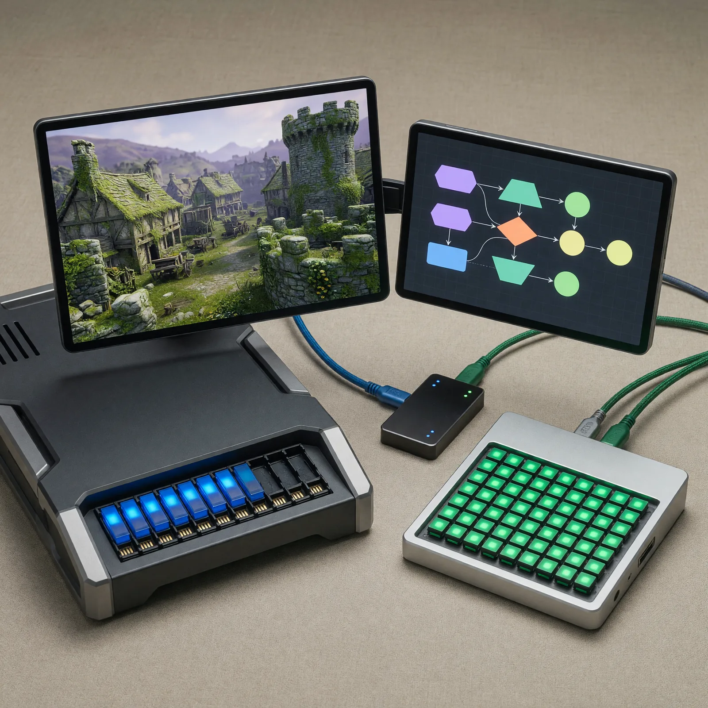

# Field Note: My Practical AI Stack: Local Models, Frontier Models, And What They Cost Me

Date: 2026-07-12



## Summary

My practical AI stack is not local versus frontier.

It is local **and** frontier, with each workload routed to the machine, model,
and billing model that fits it best.

My main machine is a Mac Studio with an M4 Max and 48GB of unified memory. With
Codex and Unreal Engine 5.8 open, I regularly see about 33GB in use. That still
leaves enough headroom for CrossOver 26.2 and older Windows games such as
EverQuest, EverQuest II, and EverQuest Legends while Codex and Unreal keep
working in the background.

But that remaining memory is also the budget a local model would need.

That is why GPT-5.6 Sol Ultra with Fast mode in Codex remains my daily driver. I
use it for coding, research, scheduled agents, Unreal development, and the kind
of ongoing collaboration that produced this note. It has been incredible for my
mix of price, speed, and performance.

Local models still matter. I run OpenClaw on a separate Mac mini with 32GB of
memory, using Ollama and `gemma4:e4b` as the current balanced default. That
machine can stay focused on persistent local-agent work without competing with
Unreal, Codex, or games on my main workstation.

The lesson is simple: a memory budget is a workload budget.

## Observation

The practical boundary showed up in Activity Monitor before it showed up in a
model benchmark.

My 48GB Mac Studio can comfortably support a surprisingly rich interactive
stack. I can have Codex running GPT-5.6 Sol Ultra with Fast mode, keep an Unreal
Engine 5.8 project open, and launch an older Windows game through CrossOver.
CodeWeavers describes CrossOver as a compatibility layer that translates
Windows commands for macOS, with several graphics backends available for
different games. For me, it is another real workload sharing the same machine.

At roughly 33GB in use, the remaining 15GB is meaningful headroom. It is enough
for the older games I enjoy. It is not free capacity I can also assume belongs
to Ollama.

Apple's unified-memory architecture is one shared resource pool for the work I
am asking the machine to do. Loading a local model means its weights, runtime,
context cache, and active requests all enter that same competition.

That changed the question from:

> Can this Mac run a local model?

to:

> Which combination of work do I want this Mac to run at the same time?

The answer is different on my two machines.

## Why It Matters

Local-model conversations can become ideological very quickly.

One side treats local as the only serious path because it offers control,
privacy, and no marginal token bill. The other treats frontier subscriptions as
the obvious answer because the models are stronger and the setup is easier.

My experience is less binary.

Local inference does not eliminate cost. It moves cost into hardware, memory,
electricity, downloads, setup, model selection, updates, and the time required
to keep the system useful. Frontier access does not eliminate constraints
either. It introduces plan limits, variable API bills, provider policy changes,
and dependency on a remote service.

The useful comparison is the whole workload:

- What quality does the task require?
- How much memory can the machine spare while the task runs?
- Does the work need to remain local?
- Is the workload interactive, persistent, scheduled, or bursty?
- Am I paying a predictable subscription or an open-ended per-token bill?
- What other work does this choice prevent the machine from doing?

Those questions are more useful to me than asking which model wins in the
abstract.

## The Cost Change That Made Local Real

My move toward local models was not theoretical. It followed a real change in
cost.

I previously ran OpenClaw with Claude Opus 4.6 through a $200 Anthropic
subscription. I named that OpenClaw **Gandalf**, and that is when the system
really shined for me.

Gandalf and I had long philosophical conversations, researched esoteric topics,
explored Hermetic principles, and worked through the Jungian ideas I wrote about
in [Claude's J-Space And The Wise Old Man](2026-07-06-claude-j-space-wise-old-man.md).
Some people may even remember the wise wizard's messages and anecdotes showing
up in my Instagram stories during that period.

When third-party subscription use stopped working the way it had for my setup,
the practical path available to me became usage-based API billing. Continuing
the same level of conversations and research cost me more than $20 on some days.
That was my observed spend, not a universal estimate, but it was enough to make
the old pattern unsustainable for me.

So I moved Gandalf to Ollama and Gemma 4.

Provider rules continued changing after that decision. OpenClaw's current
Anthropic documentation says Anthropic later paused a separately announced
Agent SDK billing transition, and supported Claude CLI or third-party usage can
currently draw from signed-in subscription limits in some paths. Direct API-key
usage remains pay as you go. I still treat this as a moving boundary and verify
the active authentication and billing path before assuming what a persistent
agent will cost.

The durable lesson is not about one provider. It is that a model change can be
an economics decision before it is a capability decision.

## My Current Model Budget

Here is the practical monthly picture for my personal AI subscriptions:

| Part of my stack | What I pay | How I use it |
| --- | ---: | --- |
| OpenAI Pro | $100/month | My main ChatGPT and Codex subscription for daily coding, scheduled agents, research, chat, and Unreal work |
| Anthropic Pro | $20/month | Personal Claude Code use, browser chat, and occasional demos |
| Ollama and local Gemma 4 | No per-token fee | Persistent local OpenClaw work on hardware I already own |
| Chainlink Labs enterprise Claude access | Employer-provided | Work use of Claude Code and Opus 4.8; excluded from my personal total |

My fixed personal subscription baseline is therefore **$120 per month** before
variable API usage, hardware, electricity, or other services.

I know even $100 per month can be unaffordable for many people. That is one
reason I want to document the local path. But for my current workload, OpenAI
Pro has been exceptional value.

The same subscription gives me ChatGPT and Codex access. I run multiple
scheduled agents for a combined total of about 90 minutes each day, code daily,
work in chat, research, and build in Unreal. I have only reached my five-hour
usage limit once or twice.

OpenAI now documents GPT-5.6 Sol as available in Codex, `ultra` as its
highest-capability setting for complex work, and Fast mode as the speed option
for time-sensitive Codex sessions. I am using GPT-5.6 Sol Ultra with Fast mode
right now. For my real workload, it has been an amazing balance of capability,
speed, and predictable subscription cost.

## Two Macs, Two Jobs

My current hardware split is deliberate.

### Mac Studio: Interactive Frontier Work

The 48GB Mac Studio is where I want responsiveness across several demanding
applications:

- GPT-5.6 Sol Ultra with Fast mode in Codex
- Unreal Engine 5.8
- daily coding and research
- scheduled agent work
- CrossOver and older games
- occasional experiments with a larger Gemma 4 26B local variant

The Studio can run larger local models, and the 26B experiments are surprisingly
snappy. I simply do not want a large local model permanently competing with the
rest of that stack.

### Mac Mini: Persistent Local Work

The 32GB Mac mini has a different job:

- OpenClaw stays available there
- Ollama provides the local model harness
- `gemma4:e4b` is the current default
- persistent agent work does not disturb my interactive workstation

This is less dramatic than buying one enormous machine to do everything. It is
also more practical for me. The second machine creates a resource boundary I
can see and reason about.

## Ollama Setup On A Mac

Ollama supports Apple Silicon on macOS Sonoma 14 or newer. Its macOS guide
recommends mounting the DMG, moving Ollama into Applications, and allowing the
app to make the `ollama` command available in the shell. Models and
configuration live under `~/.ollama`, and model files can consume tens or even
hundreds of gigabytes of storage.

After installing Ollama, this is the basic flow I use for Gemma 4:

```sh
ollama pull gemma4:e4b
ollama run gemma4:e4b
ollama list
ollama ps
ollama stop gemma4:e4b
```

The commands have distinct jobs:

- `pull` downloads the selected model artifact.
- `run` loads it and opens an interactive session.
- `list` shows models stored locally.
- `ps` shows what is currently loaded and how it is being processed.
- `stop` unloads the model instead of waiting for Ollama's default idle period.

The [Ollama Gemma 4 library](https://ollama.com/library/gemma4/tags) is where I
check the current tags and sizes before pulling a variant.

## What Model Size Does Not Tell Me

Ollama currently lists `gemma4:e4b` as an approximately 9.6GB artifact with a
128K supported context window. That does **not** mean the running workload will
consume exactly 9.6GB of unified memory.

Runtime memory can also include:

- the inference runtime itself
- the allocated context and key-value cache
- active prompt and response state
- parallel requests
- other loaded models
- the rest of the operating system and applications

There is another important distinction: a model can support a 128K context
window while Ollama allocates a smaller context by default. Ollama currently
documents a 4,096-token default unless the context setting is changed. Larger
contexts and parallel requests require more memory.

That is why I check the running system instead of reasoning only from the model
download page:

```sh
ollama ps
```

On a machine with active creative and development workloads, the real question
is not whether the artifact fits on disk. It is whether the model, its working
context, and everything else fit in memory at the same time.

## Why Frontier Still Wins My Daily Work

Local Gemma 4 is useful enough to keep Gandalf running and handle a meaningful
set of tasks without a per-message bill.

GPT-5.6 Sol Ultra is still where I get most of my daily work done.

The quality difference matters for long-running coding, research, judgment,
complex repository work, and Unreal development. Fast mode matters because I
use Codex interactively and often have several workstreams moving. The $100 Pro
subscription matters because it keeps that intensive use predictable.

This is not a claim that everybody needs my plan or my model. It is my observed
price-performance result from a workload that includes daily coding, chat,
research, 90 minutes of scheduled agents, and game development.

For me, the frontier subscription earns its place every day.

## Where Claude Still Fits

I still keep a personal Anthropic Pro subscription for $20 per month. I mainly
use it for Claude Code, browser chat, and occasional demos.

At Chainlink Labs, I use an enterprise account and work with Claude Code and
Opus 4.8 regularly. I use both the terminal experience and the VS Code plugin.
For a while I also used Cursor more heavily, but our work has mostly moved
toward Claude Code itself and its VS Code integration.

I keep that employer-provided access separate from my personal budget. It is a
different account, context, and cost center.

This is another example of the broader strategy: I do not need one model or one
provider to win every category. I need each part of the stack to justify the
work I route to it.

## What Local Changes

Running locally changes more than the invoice.

It gives me:

- a persistent agent that can keep working without marginal token billing
- direct control over which model is loaded
- a clearer privacy boundary for prompts processed locally
- resilience when provider access, billing, or policies change
- the ability to experiment with model sizes and quantizations on my hardware

It also asks me to own:

- hardware and memory capacity
- model downloads and storage
- context and concurrency settings
- quality differences between model sizes
- updates, uptime, and troubleshooting
- the electricity and attention required to operate it

That is why I do not describe local inference as free. I describe it as a
different cost model.

## Where I Want To Go Next

This note stays focused on model cost, performance, memory, and the basic Ollama
path.

A future field note can go deeper into how I run OpenClaw and Ollama as a local
system, including local coding models, local image generation with Hugging Face
models, and the operational details that keep Gandalf useful.

I have already explored the other side of that tradeoff in
[The Best AI Workflow May Be A Team Of Models](2026-07-09-best-ai-workflow-team-of-models.md),
where Codex and I integrated Grok Imagine because xAI's image API was extremely
cost-effective for the quality we wanted. I have also been impressed by Grok
video from shell, and I can imagine using local or hosted video generation as a
design probe for future Unreal concepts.

The interesting future is not purely local or purely hosted. It is a portfolio
of specialized models with visible costs and intentional routing.

## What I Should Watch

I need to avoid:

- treating a model's parameter label as a complete measure of quality
- assuming a download size equals runtime memory use
- allocating a maximum context window just because the model supports it
- calling local inference free while ignoring hardware and operating costs
- calling a subscription unlimited when usage limits and provider policies can change
- mixing personal subscriptions, employer accounts, and API spend into one misleading total
- letting one strong model become the default for tasks a smaller local model can handle well
- forcing local inference onto the workstation when a dedicated machine is the cleaner boundary

The goal is not to defend one stack forever. It is to keep measuring whether
the stack still fits the work.

## Evaluation Ideas

I can evaluate this strategy by asking:

- How much unified memory remains before and after loading a local model?
- Does the full workload stay responsive, or does memory pressure change the experience?
- What task quality do I lose or gain when I route work from frontier to local?
- What is my fixed monthly subscription cost versus variable API spend?
- How often do I actually hit plan limits?
- How much setup and maintenance time does local inference require?
- Does a dedicated machine improve reliability enough to justify its hardware and energy cost?
- What context size does the task really need, and what memory does that allocation consume?
- Which workloads benefit materially from keeping prompts local?
- Can I explain why each recurring workload is assigned to its current model?

The best configuration is the one that keeps answering those questions well as
the models, pricing, and work change.

## Sources

- Ollama: [macOS installation and storage](https://docs.ollama.com/macos)
- Ollama: [Quickstart](https://docs.ollama.com/quickstart)
- Ollama: [FAQ for context, loaded models, privacy, and concurrency](https://docs.ollama.com/faq)
- Ollama: [Gemma 4 model tags](https://ollama.com/library/gemma4/tags)
- OpenAI: [GPT-5.6 availability and Codex controls](https://openai.com/index/gpt-5-6/)
- OpenAI: [Using Codex with a ChatGPT plan](https://help.openai.com/en/articles/11369540-using-codex-with-chatgpt)
- OpenAI: [ChatGPT release notes for the $100 Pro plan](https://help.openai.com/en/articles/6825453-chatgpt-release-notes)
- Anthropic: [Claude Pro pricing](https://claude.com/pricing)
- Anthropic: [Using Claude Code with Pro or Max](https://support.claude.com/en/articles/11145838-use-claude-code-with-your-pro-or-max-plan)
- Anthropic: [Claude subscriptions and API billing are separate](https://support.claude.com/en/articles/9876003-i-have-a-paid-claude-subscription-pro-max-team-or-enterprise-plans-why-do-i-have-to-pay-separately-to-use-the-claude-api-and-console)
- Anthropic: [Claude Opus 4.8](https://www.anthropic.com/claude/opus)
- OpenClaw: [Anthropic authentication and current billing-path guidance](https://docs.openclaw.ai/providers/anthropic)
- Apple: [Mac Studio technical specifications](https://support.apple.com/en-us/122211)
- CodeWeavers: [CrossOver Mac user guide](https://support.codeweavers.com/en_US/crossover-mac-user-guide)

## Working Principle

The right model is a resource-allocation decision: route each workload to the
machine, model, and billing model that gives it enough capability without
starving everything else.
