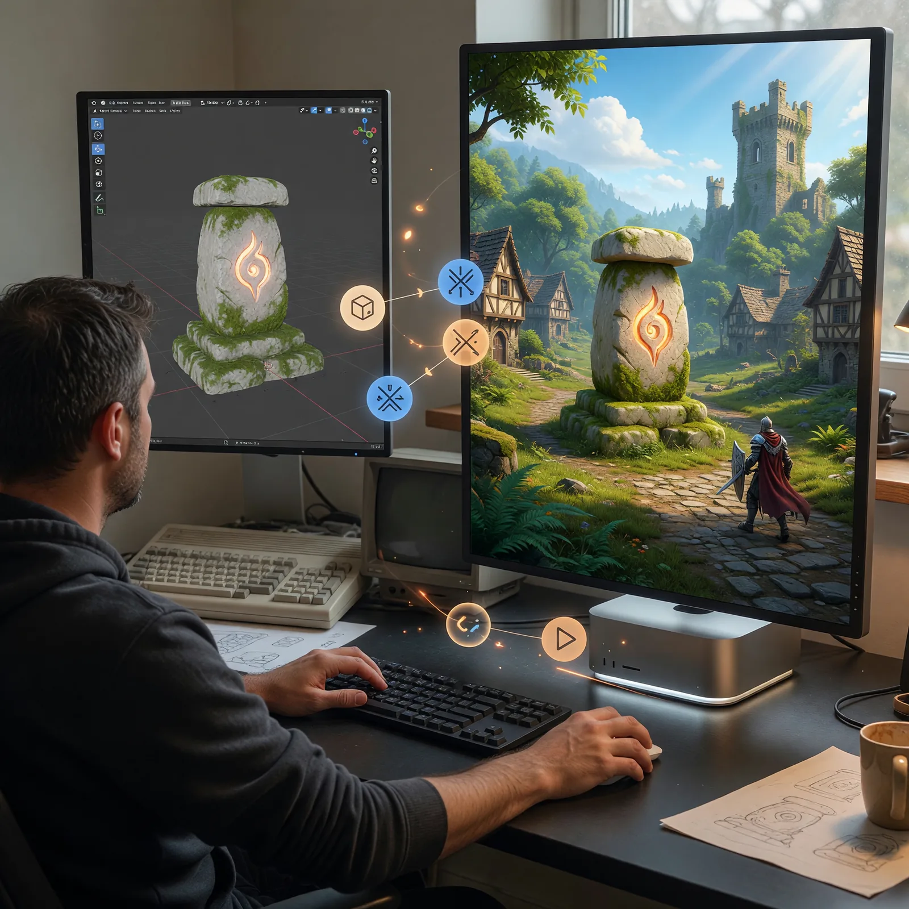

# Field Note: From My Amiga 500 To Blender MCP: Building Embermere's First Original Asset

Date: 2026-07-14



## Summary

In 1987, I saved money from my paper route and my job at McDonald's to buy an
Amiga 500. I had already grown up with a Commodore 64, but the Amiga felt like
the future: graphics, sound, multitasking, and the sense that one affordable
machine could become a creative studio.

I learned C on that Amiga and fell in love with programming. I still refurbish
and collect Commodore Amigas, and I still keep working hardware today.

That personal history made this experiment feel unusually circular. Blender's
own prehistory reaches back to an Amiga 3D tool called Traces. Nearly four
decades after I bought my A500, Codex and I connected Blender to our Unreal
Engine 5.8 project through MCP, created Embermere's first original environment
model, imported it into the game, placed it in the live starter zone, and
verified that the rest of the RPG still worked.

The result is a stylized mossy waystone with a warm ember rune. The more useful
result is a repeatable asset pipeline: reviewed source script, editable Blender
file, preview, FBX, explicit collision, Unreal import, map placement, fresh
saved-map validation, and gameplay regression tests.

## Observation

I have opened Blender from time to time over the years. I have always respected
what it can do, but its depth also makes it easy for an occasional user to feel
lost. Modeling, materials, UVs, pivots, normals, collision, export settings,
and engine conventions all have to line up before a beautiful render becomes a
useful game asset.

The shared X post that kicked off this work showed the appealing version of the
loop: describe an object, let a frontier model build it in Blender, inspect the
render, and ask the model to fix what is wrong.

I wanted to know whether that loop could survive contact with a real game
project.

Embermere is our early-2000s-inspired high-fantasy RPG prototype. Codex and I
already use Unreal MCP to inspect actors, run tests, control Play In Editor,
capture the viewport, and save editor changes. We had also imported several
free Fab/Epic environment packs to move beyond greybox geometry.

Those packs gave us speed and breadth. They did not automatically give
Embermere its own visual identity.

Blender became the missing original-art lane.

## Why The Amiga Connection Matters To Me

Blender did not begin on the Amiga under the Blender name. Its official history
says Ton Roosendaal's early in-house tools included a ray tracer built for the
Amiga. A detailed historical interview identifies that predecessor as Traces,
developed during the period when the Amiga was Roosendaal's main development
machine from 1987 into 1991.

The details feel wonderfully familiar to anyone who lived through that era.
Roosendaal described beginning on an Amiga 500 with 512 KB of memory, moving to
GFA Basic because it was faster, and using small assembly routines where they
helped. Traces combined ray tracing with more practical Z-buffer and scanline
work as production needs grew.

Some Blender conventions were already visible there. The historical Traces
build used right-click selection, left-click placement of a 3D cursor, numpad
views, and G/R/S for Grab, Rotate, and Scale. Roosendaal credited Sculpt 3D for
the 3D cursor idea.

The official Blender timeline begins on January 2, 1994, when the first source
files named Blender were written for the NeoGeo animation studio. Blender 1.0
followed in January 1995 on Silicon Graphics hardware, and the name came from a
song by Yello.

After Not a Number closed in 2002, the Blender Foundation's Free Blender
campaign set a EUR 100,000 goal and raised about EUR 110,000 in seven weeks. On
October 13, 2002, Blender was released under the GNU GPL.

That history is more than trivia to me. The Amiga showed a generation that a
home computer could be a serious creative machine. Blender carried part of
that spirit forward. Using it now to make an original asset for a game I am
building with an AI collaborator feels like the same idea moving through a new
tool era.

## The Pipeline We Chose

I did not want to connect Codex to the first Blender MCP server I found and
give it unrestricted execution authority.

Blender automation is powerful because Blender Python is powerful. It can also
reach the operating system with the privileges of the Blender process. One
popular Blender MCP project exposes broad Python execution, and its repository
has an open report describing the resulting arbitrary-code risk.

For Embermere, we selected the community `djeada/blender-mcp-server`, pinned it
to a reviewed commit, and configured its guardrails:

- the add-on listens only on `127.0.0.1:9876`;
- Safe Mode is enabled;
- inline code is disabled;
- approved scripts are limited to Embermere's tracked Blender source folders;
- the async Python execution tool is disabled in Codex;
- write-capable MCP calls remain approval-gated.

The project MCP configuration is concrete and reviewable:

```toml
[mcp_servers.blender]
command = "/absolute/path/to/blender-mcp-server/.venv/bin/blender-mcp-server"
cwd = "/absolute/path/to/blender-mcp-server"
enabled = true
required = false
startup_timeout_sec = 20
tool_timeout_sec = 180
default_tools_approval_mode = "prompt"
disabled_tools = ["blender_python_exec_async"]
```

The absolute paths change on another machine. The security shape should not.

We installed Blender 5.1.2, built and enabled the MCP add-on, and confirmed the
bridge exposed 27 structured tools. Scene inspection worked. A tracked script
inside the approved project root worked. Inline code was rejected.

That negative test mattered as much as the successful one.

## Our First Original Embermere Model

We deliberately started with a bounded static prop instead of a creature,
character, or animation rig.

The brief was a stylized standing-stone shrine with:

- a classic high-fantasy silhouette;
- pale carved stone and moss accents;
- a warm ember-colored rune;
- readable shape at gameplay distance;
- three material regions;
- a ground-level pivot;
- explicit Unreal collision;
- modest geometry suitable for a small starter zone.

Codex wrote a deterministic Blender source script rather than relying on a
one-off manual scene. The script creates the mesh, materials, UVs, camera,
lights, preview render, Blender source file, FBX export, collision boxes, and a
machine-readable validation summary.

The first render was too dark.

That was useful. We revised the lighting and rendered again instead of
declaring victory because the script completed. The final Blender result had:

| Check | Verified result |
| --- | --- |
| Dimensions | About 163.7 x 92.0 x 198.9 cm |
| Render geometry | 1,340 triangles |
| Materials | Stone, moss, and ember |
| UV channels | One |
| Non-manifold edges | Zero |
| Object scale | 1.0, 1.0, 1.0 |
| Pivot/bounds | Grounded at Z = 0 |
| Collision | Two Unreal-named box colliders |

Then we imported the FBX into Unreal under:

```text
/Game/Art/Embermere/Environment/PrototypeVillage/SM_EmbermereWaystone_01
```

Unreal retained the three material slots and both imported collision boxes. It
reported a minimum Z bound of exactly zero and a maximum around 196.4 cm.

That was the first moment the experiment became more than a Blender demo. The
asset had crossed the engine boundary with its technical contract intact.

## The Bug We Only Found In The Real Map

We replaced a temporary Fab road stump with the new waystone.

Our first placement order was wrong. We added the waystone with
snap-to-ground enabled before deleting the stump it was replacing. Unreal
correctly snapped the new asset to the top of the old stump. When the stump was
removed, the waystone floated about 130 cm above the road.

The asset was valid. The placement sequence was not.

Codex and I corrected the actor to the authored road elevation, disabled snap
for that deterministic placement, and added the exact Z coordinate to the
fresh-process map validator.

The final saved actor is:

```text
Name: Embermere_Waystone_Road_01
Location: (-690, -25, 20)
Yaw: 30 degrees
Tag: EmbermereOriginalArt
```

The map now contains 64 third-party `FabPass_` environment actors and one
separately tagged project-owned original. That distinction is intentional. It
lets us keep using purchased and free packs without confusing their ownership
or redistributing vendor source.

## Verification In Unreal

The pipeline was not complete when the model looked good in Blender or when its
thumbnail appeared in Unreal.

We required the same engineering evidence we use for gameplay work:

1. inspect Blender dimensions, topology, UVs, transforms, and collision;
2. import the FBX through Unreal's static-mesh pipeline;
3. inspect Unreal bounds, triangles, materials, lightmap data, and collision;
4. place the asset in the saved Embermere map;
5. inspect it from the rune side at gameplay distance;
6. run the map validator from a fresh headless Unreal process;
7. rebuild `EmbermereEditor` with hot reload disabled;
8. run the complete gameplay automation suite.

The final result:

- Mac editor build succeeded;
- fresh saved-map validation passed;
- the validator found 64 upright Fab actors plus the exact original waystone;
- all 16 Embermere automation tests passed;
- zero tests failed;
- zero test warnings were reported.

The game systems did not care whether the road marker came from Fab or Blender.
That is exactly what asset-agnostic gameplay architecture is supposed to buy
us.

## What GPT-5.6 Sol Changed For This Work

I am doing this work in Codex with GPT-5.6 Sol Ultra and Fast mode.

The useful capability is not simply that the model can emit Blender Python. It
can hold several technical contracts together across applications:

- Blender scene construction and deterministic validation;
- MCP permissions and server configuration;
- FBX naming, scale, orientation, materials, UVs, and collision;
- Unreal asset inspection and saved-map editing;
- C++ build and automation regression checks;
- durable documentation and source-control hygiene.

That combination is what made the loop valuable. A model that produces a nice
render but loses the collision boxes, imports at the wrong scale, or breaks the
quest route has not finished the task.

I still do not treat one successful asset as proof that AI can replace an art
team. It is evidence that a frontier model, a constrained tool bridge, and an
engine-aware validation loop can help a small team create and iterate on
bounded original assets.

## The Mac Studio Reality Check

This experiment also extended the memory-budget observation from my previous
field note about local and frontier models.

On my 48 GB Mac Studio, I had ChatGPT Codex, Unreal Engine 5.8, Blender, and the
MCP bridges running together and still observed about 11 GB free.

That is not a universal benchmark. Scene size, editor state, shaders, renders,
browser tabs, memory compression, and background applications all move the
number. It is still a useful firsthand result: this particular frontier-model
creative stack fit on my main workstation without requiring me to load a large
local model into the same unified-memory budget.

For readers of my earlier note, it reinforces the same rule. Memory headroom is
workload headroom. Today I spent it on two creative applications and an agent
harness instead of local inference or a CrossOver game.

## Why It Matters

The important choice is not Fab assets or Blender assets.

It is breadth plus identity.

Fab remains useful for forests, rocks, temporary architecture, animation-heavy
content, VFX, audio, and specialist packs. Blender gives us a path to replace
the most recognizable parts of Embermere one family at a time.

Our next original assets should be close cousins of the waystone: an ember road
lamp, a signpost, low boundary stones, and a small quest shrine. Reusing a
shared material and shape language will create cohesion faster than attempting
an original dragon on day one.

The same principle applies beyond game development. AI-assisted creative tools
become much more useful when the output enters a real downstream system with
visible acceptance criteria.

## Evaluation Ideas

I want to evaluate this pipeline over a larger asset family:

- How long does brief-to-first-render take for each static prop?
- How many render/inspect/revise loops are needed before the silhouette reads?
- Do dimensions, transforms, UVs, pivots, material slots, and collision pass on
  the first Unreal import?
- How often does the live map expose problems that isolated Blender validation
  cannot see?
- Can deterministic scripts reproduce an asset after Blender or add-on updates?
- Does a shared material and silhouette language make independently generated
  props feel like one world?
- How much manual art direction remains necessary at each stage?
- Can the same pipeline support modular architecture without seams or scale
  drift?
- Does the Mac remain responsive as Blender scenes and Unreal content grow?
- Do MCP security boundaries remain understandable and reviewable over time?
- Which assets are cheaper or better to license from Fab than to create?

The goal is not to maximize the number of AI-generated models. It is to build a
cohesive game while understanding where this workflow creates real leverage.

## Sources

- Blender Foundation, "Blender's History": https://www.blender.org/foundation/history/
- Piotr Zgodzinski, interview with Ton Roosendaal, "Blender's prehistory - Traces on Commodore Amiga (1987-1991)": https://zgodzinski.com/blender-prehistory/
- Blender MCP experiment that prompted this work: https://x.com/explosss1ve/status/2075654835597164769
- Selected structured community Blender MCP server: https://github.com/djeada/blender-mcp-server
- Open security report for unrestricted Blender MCP execution: https://github.com/ahujasid/blender-mcp/issues/201
- OpenAI, "Model Context Protocol": https://developers.openai.com/codex/mcp
- Epic Games, "FBX Static Mesh Pipeline": https://dev.epicgames.com/documentation/en-us/unreal-engine/fbx-static-mesh-pipeline-in-unreal-engine
- Embermere RPG source and asset pipeline: https://github.com/disbitski/embermere-rpg
- Real World AI Lab, "My Practical AI Stack": https://github.com/disbitski/real-world-ai-lab/blob/main/field-notes/2026-07-12-my-practical-ai-stack.md

## Working Principle

An AI-made game asset is not done when it renders; it is done when its source,
ownership, scale, geometry, materials, collision, engine placement, and gameplay
regressions all survive inspection.
