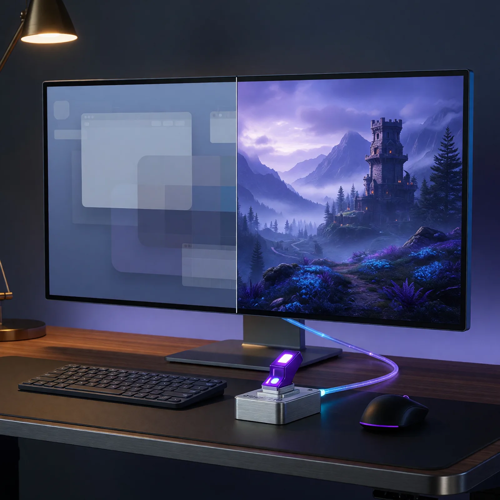
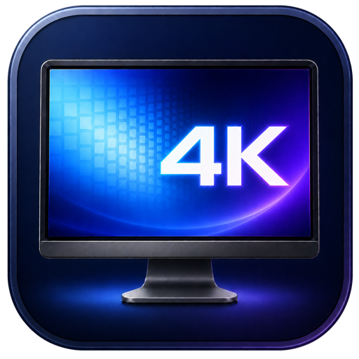
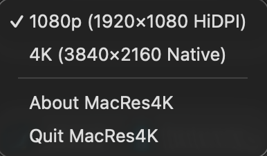

# Field Note: From Morrowward to MacRes4K—When AI-Built Experience Compounds

Date: 2026-07-21



## Summary

MacRes4K began with a small irritation that kept interrupting something I enjoy.

<p align="center">
  <a href="https://github.com/disbitski/MacRes4K">
    
  </a>
</p>

My normal desktop setting on a 4K monitor is 1920×1080 HiDPI. macOS gives me
the comfortable size of a 1080p workspace while rendering it with the full
3840×2160 physical pixel grid. It is the right setting for everyday desktop
use.

Gaming needs the opposite choice. When I run games through CrossOver and Wine,
the game sees the macOS desktop resolution instead of reliably switching the
display the way I expect on Windows. If the Mac desktop is still in the HiDPI
mode, 3840×2160 is not available to the game in the way I need. Some native
macOS games launched from Steam switch correctly, while others behave more like
the CrossOver titles. Before playing games I enjoy, including EverQuest
Legends, I have to put macOS in native 4K first and switch back when I am done.

The utilities I tried exposed long mode lists, duplicate-looking resolutions,
refresh rates, bookmarks, and distinctions that were hard to scan. I did not
need a display-management dashboard. I needed one menu-bar icon, two exact
choices, and a checkmark.

Codex and I turned that need into MacRes4K, a native Swift and AppKit utility
for macOS 13 and newer. It switches only the main display between exact 1080p
HiDPI and native 4K modes, preserves refresh rate when possible, starts at
login, restores the desktop-friendly mode when it quits, has no Dock icon or
window, and ships as an ad-hoc-signed universal application.

The complete [MacRes4K source, build instructions, and universal
release](https://github.com/disbitski/MacRes4K) are available on GitHub.

The project was small, but it did not start from zero. Four days building
Morrowward had already taught Codex and me how to move through Xcode targets,
Apple-platform builds, device behavior, packaging, verification, and visual
acceptance together. MacRes4K showed me what happens when that experience
compounds: a personal annoyance can become a polished native tool while the
reason for building it is still fresh.

## Observation

Resolution labels hide an important difference on a Retina-style display.
"1920×1080" can describe an ordinary low-resolution mode with 1920×1080
physical pixels, or a HiDPI mode with a 1920×1080 logical workspace rendered
through 3840×2160 physical pixels. Both can look like 1080p in a generic list.
Only one is the desktop mode I wanted.

Native 4K is different again: it is 3840×2160 logically and physically. That
gives a game the full desktop resolution, but makes normal macOS interface
elements much smaller. Neither mode is universally better. They are two tools
for two contexts.

The recurring workflow was therefore simple but annoying:

1. Open a display utility or System Settings.
2. Find the correct native 4K mode among similar entries.
3. Launch the game.
4. Reverse the process afterward without accidentally choosing ordinary
   low-resolution 1080p.

That repetition was the product brief. MacRes4K would encode the distinction
once and make the correct choice obvious every time.

## Two Choices Are The Feature

The finished menu intentionally contains only the two presets, About, and
Quit. A checkmark follows the actual display mode rather than merely recording
the last menu item clicked. If System Settings or another application changes
the resolution, MacRes4K refreshes its state after display reconfiguration,
sleep, wake, and reconnect events. If the current mode is neither exact preset,
neither item is checked.



The first version of the application icon taught the same lesson at a smaller
scale. The monitor shape was right, but four panes on its screen read like a
Windows logo. I rejected it. The approved icon keeps the monitor and replaces
the panes with a clear blue-and-violet 4K mark. The code already worked; human
judgment made the product feel like ours.

The About item came from the same final polish pass. It explains the utility in
one sentence and links to [thedavedev.com](https://thedavedev.com/). The app
stays tiny without feeling anonymous or unfinished in Finder.

## The Exact Mode Contract

The central technical decision was to classify display modes by both their
logical dimensions and physical pixel dimensions. This shortened version of
the production Swift contract shows why:

```swift
case .hiDPI1080:
    return mode.logicalWidth == 1_920
        && mode.logicalHeight == 1_080
        && mode.pixelWidth == 3_840
        && mode.pixelHeight == 2_160

case .native4K:
    return mode.logicalWidth == 3_840
        && mode.logicalHeight == 2_160
        && mode.pixelWidth == 3_840
        && mode.pixelHeight == 2_160
```

Ordinary 1920×1080 fails the HiDPI contract because its physical dimensions are
also only 1920×1080. MacRes4K never selects it.

The app asks CoreGraphics for the main display's desktop-usable modes. It
enables switching only when both exact contracts are available. When multiple
matching modes exist, it preserves the current refresh rate within a small
tolerance; if no match exists, it uses the highest available refresh rate for
the requested preset.

That behavior is covered by unit tests for exact HiDPI classification,
low-resolution rejection, native-4K classification, fractional refresh-rate
matching, highest-refresh fallback, and checkmark state. Seven tests passed in
the final build.

## The Safe Default Is A Session Baseline

The utility does more than call `CGDisplaySetDisplayMode` twice.

At launch, MacRes4K establishes 1080p HiDPI as the CoreGraphics configuration
for the current login session. Native 4K is then an app-lifetime override. Quit
restores the HiDPI session mode before terminating. If that restore fails, the
app offers to keep running instead of silently leaving the display in an
unexpected state. Because native 4K is not committed as the session baseline,
an unexpected app termination also lets CoreGraphics return to the desktop
mode.

This was a small but important product boundary. Native 4K is temporary gaming
intent. Comfortable HiDPI is the safe desktop state.

MacRes4K also registers the installed main app with `SMAppService.mainApp` so
the two-mode workflow is available after login, subject to macOS Login Items
approval. Development builds running from Xcode's DerivedData skip that
registration. The release contains both Apple silicon and Intel slices,
retains the monochrome `display` SF Symbol in the menu bar, and uses the custom
monitor-and-4K artwork in Finder.

## Morrowward Made The Next Xcode Project Faster

Morrowward was a much larger product: a web application plus iPhone and Mac
companions, built during OpenAI Build Week. MacRes4K is deliberately tiny. The
domains are different, but the collaboration experience transferred directly.

| Experience from Morrowward | How it changed MacRes4K |
| --- | --- |
| We had already built and packaged Apple companion apps in Xcode. | Project targets, schemes, Info.plist behavior, universal builds, signing, and app-bundle inspection were familiar parts of the path. |
| Device use had found problems desktop fixtures missed. | We treated the real 4K monitor, menu bar, Finder icon, sleep/wake, and CrossOver behavior as acceptance evidence. |
| Deterministic code owned financial math and safe fallbacks. | Exact mode contracts and CoreGraphics configuration own resolution changes; menu state reflects observed display state. |
| Codex turned clear decisions into implementation, tests, and builds. | GPT-5.6 Sol Ultra with Fast mode inspected the local SDK, built the Swift/AppKit utility, generated the Xcode project, wrote tests, and verified Debug and universal Release output. |
| I owned mission, taste, and final acceptance. | I defined the two-mode experience, rejected unnecessary UI and the Windows-like icon, approved the final icon, About flow, and real menu screenshot. |

That is the kind of AI acceleration I find most valuable. The model did not
need me to remember every CoreGraphics function or Xcode build setting. I did
need to explain the lived problem precisely, distinguish two modes that share a
label, test the result on the actual display, and decide when the experience
felt complete.

OpenAI's current Codex guidance recommends supplying a goal, relevant context,
constraints, and a concrete definition of done, then asking Codex to write or
update tests, run the right checks, confirm behavior, and review the result.
Our workflow followed that shape. The prompt was not "make a resolution app."
It specified the exact logical and physical dimensions, the main-display
boundary, refresh behavior, lifecycle restoration, login behavior, menu copy,
failure handling, tests, and delivery artifacts. That context made autonomous
implementation useful without surrendering the acceptance decision.

## Why It Matters

MacRes4K will not change the software industry. It will remove a small point of
friction from something I enjoy on two Macs.

That is precisely why it matters to me.

Custom software used to carry a high enough implementation cost that many
personal annoyances were not worth solving. You tolerated the generic utility,
memorized the workaround, or waited for a commercial product to match your
exact preference. A strong human-AI development loop changes that threshold.

Experience compounds on both sides of the collaboration. I brought forward
what Morrowward taught me about Xcode, device testing, product boundaries, and
acceptance. Codex brought forward the ability to inspect the environment,
translate a precise behavior into native code, run tests, package artifacts,
and iterate quickly from visual feedback. The next project became easier not
because the problem was trivial, but because our working relationship already
contained reusable knowledge.

The result is a full-featured application in the sense that matters: it solves
the complete problem it chose, handles failure and lifecycle edges, looks at
home on the platform, and removes everything the user does not need.

## What I Will Repeat

1. Start from a recurring lived annoyance, not a technology demonstration.
2. Describe the desired state in observable terms, including the distinctions
   generic labels hide.
3. Keep the interface proportional to the job; two modes should remain two
   modes.
4. Turn the risky distinction into an exact data contract and unit test it.
5. Define a safe baseline before adding a temporary override.
6. Test with the real hardware and the real application that motivated the
   build.
7. Inspect the Finder icon, menu, sleep/wake behavior, packaging, architecture,
   and signing—not only the source code.
8. Let prior projects teach the next one instead of treating every AI
   conversation as a fresh start.
9. Reject visually plausible output when it communicates the wrong product.
10. Stop when the utility solves its complete purpose cleanly.

## Evaluation Ideas

- Does 1920×1080 HiDPI always report 1920×1080 logical and 3840×2160 physical
  dimensions on both target Macs?
- Can any ordinary low-resolution 1920×1080 mode ever pass the classifier?
- Does each switch preserve 59.94, 60, 120, or another current refresh rate
  when the requested preset exposes it?
- Does CrossOver expose 3840×2160 to the intended games after native 4K is
  selected?
- Which native macOS and Steam games switch the desktop themselves, and which
  still benefit from MacRes4K?
- Does the checkmark remain accurate after System Settings changes, sleep/wake,
  reconnects, and a main-display change?
- Does normal Quit restore HiDPI, and does an unexpected termination return to
  the session baseline?
- Does login launch happen only for an installed app and remain understandable
  when macOS requires Login Items approval?
- Can a new user understand the entire utility without documentation?
- How much faster was this Xcode project because the Morrowward workflow had
  already established build, test, packaging, and acceptance habits?

## Sources

- Apple Developer Documentation, [CGDisplayMode](https://developer.apple.com/documentation/coregraphics/cgdisplaymode)
- Apple Developer Documentation, [CGDisplayCopyAllDisplayModes](https://developer.apple.com/documentation/coregraphics/cgdisplaycopyalldisplaymodes(_:_:))
- Apple Developer Documentation, [CGDisplaySetDisplayMode](https://developer.apple.com/documentation/coregraphics/cgdisplaysetdisplaymode(_:_:_:))
- Apple Developer Documentation, [SMAppService.mainApp](https://developer.apple.com/documentation/servicemanagement/smappservice/mainapp)
- OpenAI, [Codex best practices](https://learn.chatgpt.com/guides/best-practices)
- [MacRes4K source repository and README](https://github.com/disbitski/MacRes4K)
- [The Loop That Built Morrowward: Delegation, Discernment, and Four Days of Human–AI Work](2026-07-21-morrowward-delegation-discernment-loop.md)
- [OpenAI Build Week: From a QR Code to Production in Four Days](2026-07-21-openai-build-week-four-days.md)

## Working Principle

When AI lowers the cost of implementation, lived experience can become
software—and experience from the last build can make the next one feel native.
