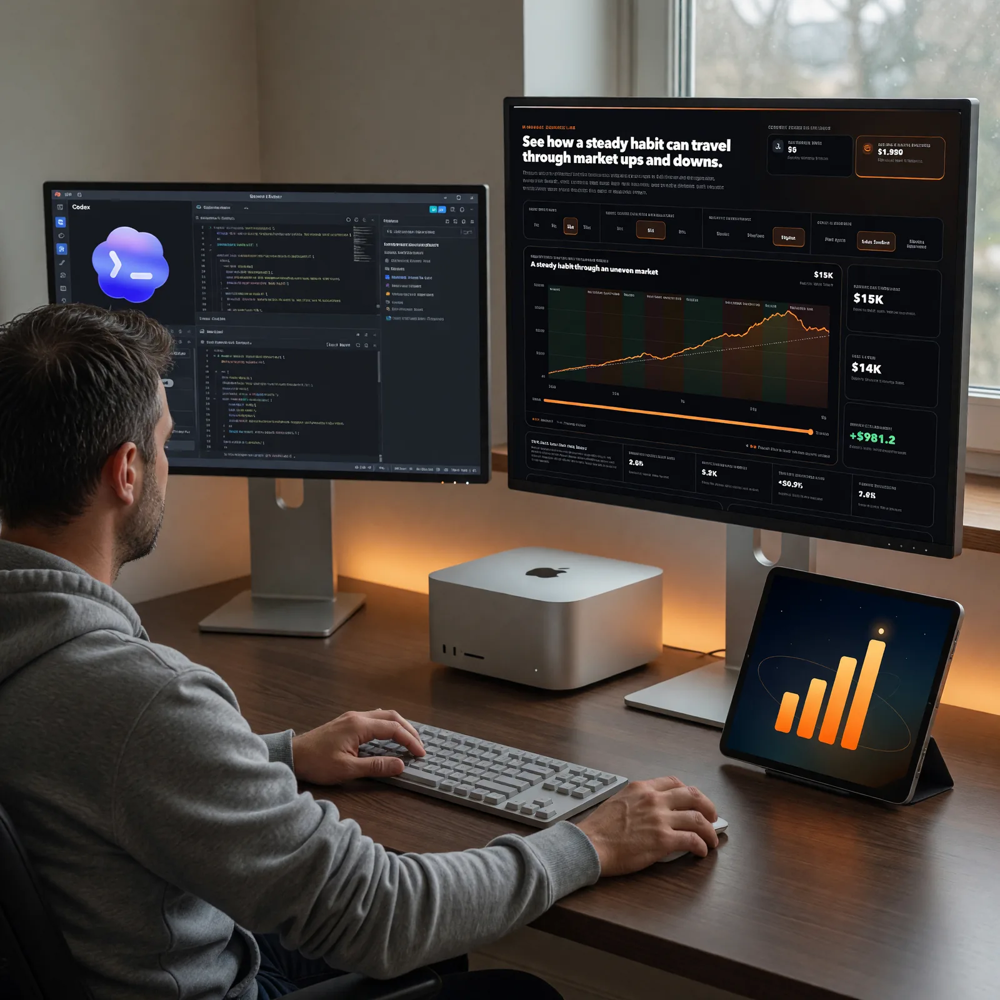

# Field Note: The Loop That Built Morrowward: Delegation, Discernment, and Four Days of Human–AI Work

Date: 2026-07-21



## Summary

I built [Morrowward](https://github.com/disbitski/morrowward), a local-first
financial-future simulator, with Codex in four calendar days during OpenAI
Build Week. The first commit landed on July 14, 2026. By the end of July 17, I
had a production web app, iPhone and Mac companion apps, a demonstration video,
and a completed Devpost submission.

The speed is interesting, but the collaboration is the more useful story.
Morrowward did not come from one perfect prompt, and I did not disappear while
an agent independently built my idea. I supplied the mission, decades of
investing experience, product taste, risk boundaries, and final acceptance
decisions. Codex, running my daily GPT-5.6 Sol Ultra setup with Fast mode,
turned those decisions into architecture, code, tests, deployments, and
bounded specialist work. Then I used the real product and judged what came
back.

Rick Dakan and Joseph Feller's AI Fluency Framework, presented through
Anthropic's course, gives me precise language for that work. **Delegation** was
how I decided what I would own, what Codex would own, and what we would do
together. The correctly named **Description–Discernment Loop** was the repeated
cycle inside that division of work: describe the desired product, build it,
use it, judge it, and refine the description from evidence.

The result is visible in more than the finished interface. Morrowward's
[contemporaneous build journal](https://github.com/disbitski/morrowward/blob/main/docs/BUILD_JOURNAL.md)
was updated across 30 commits while the complete repository grew to 44 commits.
It records the ideas I introduced, the alternatives we rejected, the tests
Codex ran, and the moments when hands-on use changed the product. Delegation
made the four-day build possible. Discernment kept the speed pointed at what I
actually meant. The journal made both inspectable.

## Observation

I started with a deeply personal goal: help people see how small, consistent
financial habits can create hope for the future. I grew up with very little,
was diagnosed with Type 1 diabetes at age ten, and knew early that I would have
to prepare for a lifetime of medical responsibility. At the same age, I bought
a Commodore 64 with paper-route savings and discovered programming. Morrowward
connects those experiences: daily discipline, education, and a future that can
become visible one step at a time.

That meaning was mine to define. I also made the product calls that carried it:
educational simulation instead of financial advice, deterministic calculations
instead of model-generated math, personal data kept on the device, simulated
trades instead of brokerage connections, and a hopeful experience rather than
a market-prediction machine.

Codex was exceptionally good at converting that intent into an engineered
system. It decomposed feedback into bounded workstreams, used subagents for
focused implementation and review, integrated their work, ran unit and browser
tests, checked accessibility and privacy, worked through Vercel deployment
details, and built the shared SwiftUI/WebKit companion architecture. I could
delegate a large amount of execution because the product boundaries were
explicit and the results remained reviewable.

But delegation was only the first decision. The product became good through
discernment after each result arrived.

## Delegation Is Not The Loop

I find this distinction important because the terms describe different work.

Anthropic's AI Fluency overview defines Delegation as thoughtfully deciding
what work to do with AI versus independently. Its Description–Discernment
lesson begins after those choices: communicate what product, process, and
collaborative behavior are needed; evaluate the output, approach, and behavior;
then refine and repeat.

That is almost exactly how Morrowward moved:

| Competency | What it looked like in this build |
| --- | --- |
| Delegation | I owned the mission, lived context, product judgment, and final acceptance. Codex owned most implementation, verification, and technical orchestration. |
| Description | I translated my investor lessons and desired feelings into concrete interactions, constraints, and examples. Codex helped turn them into specifications and tests. |
| Discernment | I used the real web, iPhone, and Mac experiences; accepted what worked; and identified what was confusing, incomplete, or technically incorrect. |
| Diligence | We checked sources, safety language, privacy, cost controls, accessibility, secrets, generated-media provenance, and release evidence before shipping. |

Delegation answered, "Who should do what?" The Description–Discernment Loop
answered, "Does what we built express the intent, and what must change on the
next pass?"

My domain knowledge did not become less important because Codex could move
quickly. It became the evaluation surface for the work.

## Six Loops That Changed The Product

The clearest evidence is in the moments when a plausible result was not the
final result.

### 1. A starter portfolio became Market Journey

The first Practice experience let someone add simulated cash and make a
fractional purchase. Technically, it worked. When I used it, I realized it
stopped before teaching the lesson I cared about.

I wanted people to see weekly dollar-cost averaging across one, five, ten, and
twenty years; to experience bull markets, pullbacks, deeper declines, and
recoveries; and to understand that a small number of unusually strong market
days can matter even though nobody knows those days in advance.

Codex turned that feedback into the deterministic Market Journey lab. It
separated long-term drift from volatility, added different market sequences,
measured drawdown, compared an all-days path with counterfactual paths missing
their strongest days, and surrounded the experience with explicit limitations.
My discernment supplied the missing lesson. Codex supplied a testable way to
teach it without pretending to forecast the market.

### 2. A refresh button became one shared daily price snapshot

The next version proposed a button for current Practice prices. I rejected that
interaction because every visitor could trigger another paid upstream request.
What I wanted was current-enough educational context, not a trading terminal.

The revised description became one daily, batched GPT-5.6 web-search job for
the allowlisted assets, with a cached shared snapshot, visible freshness,
source metadata, protected generation, bounded retries, and deterministic
fallback data. The wording also changed from "real-time" to the more truthful
"refreshed daily."

Later production use exposed another gap: the interface could show only the
Daily Price Refresh heading when the live path did not complete as expected.
That observation sent us back through the loop until the actual production
experience displayed the update time and hours since refresh correctly. The
test fixture had not replaced looking at the deployed product.

### 3. The technically safe Franklin fallback was creatively wrong

For the welcome experience, Codex orchestrated a fresh Grok pipeline that
generated, validated, and reviewed historical-figure interpretations. The
Benjamin Franklin pass produced a strong image and an animation with minor
incidental mouth movement. A stricter retry moved the face more and was
rejected. Codex then built a deterministic still-motion fallback that was
technically clean.

I watched it and said it was not good.

We returned to the stronger first animation, discarded its provider audio,
used separate disclosed AI narration, kept exact captions and source
attribution, and labeled the result as an AI-generated historical
interpretation. After reviewing the finished composition, I approved it.

No automated rubric could make that final taste decision for me. The agent
could generate options, inspect frames, validate files, and explain tradeoffs.
Discernment meant I still had to experience the result and choose what belonged
in Morrowward.

### 4. Private previews stopped being the simplest safety boundary

We began with a private GitHub repository and protected Vercel previews. That
was a reasonable early boundary. As the app matured, it created two operating
environments with different secrets, storage scopes, URLs, and cron behavior.
The private-preview setup was now making production testing and companion-app
integration harder.

We reconsidered the tradeoff and simplified to one stable, public but
unannounced Vercel production application while keeping the source repository
private through the submission deadline. We added server-side rate limits,
circuit breakers, protected cron routes, and no-index guidance rather than
assuming obscurity would control usage.

This was not a code-generation problem. It was discernment about when an
earlier decision had stopped serving the project. Codex helped audit the
consequences and implement the new boundary; I accepted the product and release
tradeoff.

### 5. The iPhone Simulator found what desktop testing could not

After the shared Apple companions compiled and passed their tests, I opened the
iPhone app myself. The native navigation chrome covered the website's hamburger
menu, which made Settings—and therefore theme selection—impractical to reach.
The Mac app did not have the problem.

The fix stayed in the shared web product: an always-visible Settings destination
joined the mobile footer. That preserved one product instead of adding
iPhone-only financial logic. A focused mobile regression test then exercised
the exact route I had found through hands-on use.

This loop is a useful reminder that "the build passed" and "the experience
works" are different judgments.

### 6. The final onboarding bug appeared only through real typing

The last bug arrived after submission while I performed another end-user pass.
On the final onboarding step, current age, target age, and starting amount
looked editable but snapped to boundary values or zero when I tried to replace
their contents.

The cause was subtle: the controlled numeric field converted and clamped every
keystroke immediately. Automated tests had used an atomic fill operation, so
they never reproduced the select-delete-type sequence a person naturally used.

Codex changed the shared field to preserve a temporary string while editing,
commit only valid values, and normalize on blur or Enter. It added sequential
keystroke coverage on desktop and mobile, reran the full suite, deployed the
fix, and reopened both Apple companions. I tested all three experiences and
confirmed the repair.

That final commit is especially valuable evidence. Discernment was not a
ceremonial review at the end. It could still challenge the tests and reopen the
loop when the real interaction disagreed with them.

## Why The Build Journal Matters

A polished product can hide the path that produced it. A Git graph shows when
files changed, but not always why a human rejected an option, why a safety
boundary moved, or which observation caused the next implementation pass.

The Morrowward build journal captured those decisions while we were making
them. It was not reconstructed after the outcome was known. Thirty repository
commits updated the journal as product work progressed, alongside 44 total
commits in the four-day history.

The reduced pattern looked like this:

```md
### Hands-on use found a product gap

- Observation: what I experienced in the real product
- Decision: what the experience needed to mean instead
- Implementation: what Codex changed and why
- Verification: tests, deployment evidence, and my acceptance result
```

The actual entries are prose rather than a rigid template, but those four kinds
of evidence recur. That structure makes the journal useful for more than a
hackathon judge. It gives me material for retrospectives, future product
decisions, and evaluation of the collaboration itself.

It also makes AI involvement more honest. "Built with AI" is too vague to
teach anyone much. The journal shows where I supplied expertise, where Codex
accelerated work, where a model or test fixture was insufficient, and where I
took responsibility for the final decision.

## Why It Matters

Fast agentic development can create the illusion that human judgment is a
bottleneck to remove. My experience was the opposite. Codex reduced the cost of
turning a decision into working software, which let me exercise judgment more
often.

I did not have to save every idea for a future sprint. I could use the latest
version, notice what it still failed to teach, and ask for a better expression
while the context was fresh. The loop tightened from weeks or months into
hours—and sometimes minutes.

That changes what product fluency looks like. A creative builder does not need
to surrender the details to gain speed. The builder can spend more time on
mission, meaning, lived experience, and evaluation while an agent handles much
of the mechanical distance between a clear decision and a testable artifact.

The risk is that speed can also multiply weak decisions. If I do not use the
product, verify claims, question defaults, and reject technically acceptable
but creatively wrong results, Codex can help me arrive at the wrong destination
faster. Delegation needs Discernment, and Discernment needs evidence.

## What I Will Repeat

For future production builds, I want to preserve this operating pattern:

1. State the human mission and non-negotiable boundaries before discussing
   implementation.
2. Delegate bounded work according to human expertise, agent capability, risk,
   and available verification.
3. Describe product, process, and collaborative behavior clearly enough that
   the first implementation is meaningful, not necessarily final.
4. Use the real artifact early on the actual deployment and target devices.
5. Convert every important observation into a clearer requirement and a
   regression check when possible.
6. Keep a contemporaneous decision record that connects judgment, code,
   verification, and acceptance.
7. Stop when the product meets the intended experience—not merely when the
   agent has no more suggestions.

The journal should stay concise enough to maintain during the work. It should
record material decisions and evidence, not every command or intermediate
thought. The commit history can preserve the detailed file changes; the journal
should preserve why the path changed.

## Evaluation Ideas

I can evaluate future human–AI builds with questions that leave observable
evidence:

- Was the human–AI division of work explicit, and did it change when risk or
  capability changed?
- Can I point to product decisions that came from human domain knowledge or
  taste rather than model output?
- How often did hands-on use produce a materially better requirement?
- Did rejected alternatives remain visible enough to explain the final choice?
- Did each important correction gain a test, contract, or deployment check?
- Did device and production testing find problems that local fixtures missed?
- Can a reader connect journal entries to commits without reconstructing the
  entire conversation?
- Did the loop preserve the original mission while the implementation evolved?
- Did I take explicit responsibility for the final output instead of treating
  agent completion as acceptance?
- Did we stop at a clear product threshold, or did speed encourage unnecessary
  scope?

A useful experiment would compare two similar product features. For one, keep
only the final code and commit message. For the other, record the description,
hands-on observation, discernment decision, verification, and acceptance. A
week later, ask whether another builder can explain why the implementation is
the way it is and confidently change it. That tests whether the collaboration
left durable understanding, not just more software.

## Sources

- [Morrowward build journal](https://github.com/disbitski/morrowward/blob/main/docs/BUILD_JOURNAL.md)
- [The 30 commits that updated the Morrowward build journal](https://github.com/disbitski/morrowward/commits/main/docs/BUILD_JOURNAL.md)
- [Morrowward repository history](https://github.com/disbitski/morrowward/commits/main/)
- [Anthropic, AI Fluency Framework overview](https://www.anthropic.com/ai-fluency/overview)
- [Anthropic, The Description–Discernment Loop](https://www.anthropic.com/ai-fluency/description-discernment-loop)
- [Anthropic, Delegation](https://www.anthropic.com/ai-fluency/ai-fluency-delegation)
- [Anthropic, Discernment](https://www.anthropic.com/ai-fluency/discernment)

## Working Principle

Delegate to accelerate execution, use discernment to preserve intent, and keep
a journal that makes both auditable.
