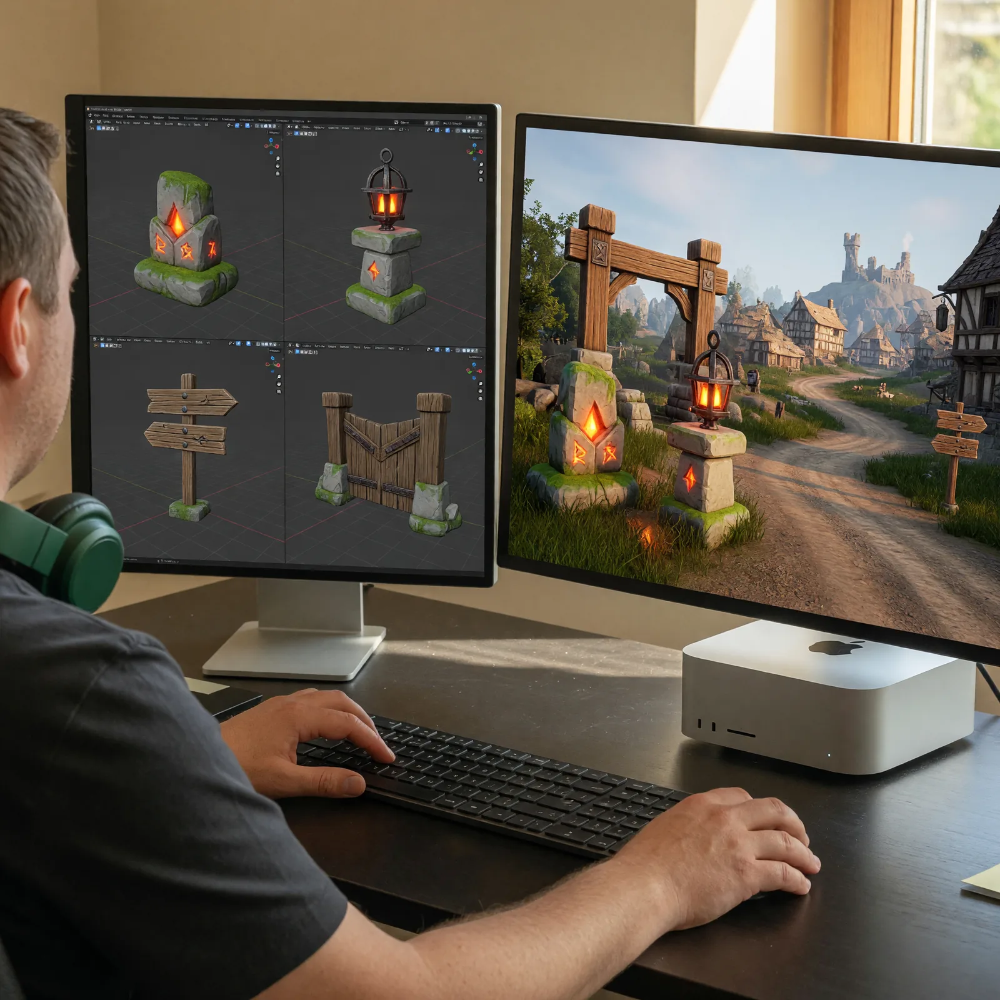
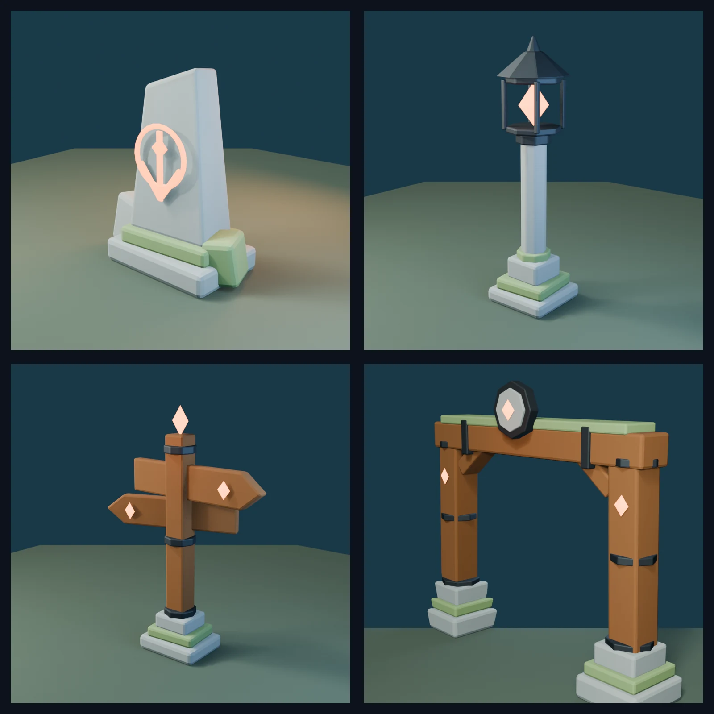
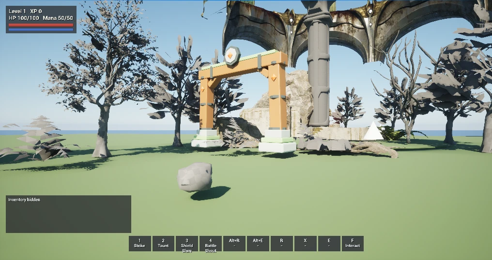

# Field Note: From One Waystone to a World: The Acceptance Loop Behind Embermere

Date: 2026-07-22



## Summary

My first Blender MCP experiment with Embermere produced one original waystone.
It proved that Codex and I could move a model from a written brief through
Blender, FBX, Unreal Engine 5.8, and into a playable map.

The question after that first success was more interesting: could we repeat the
process without treating every asset as a new demo?

Since that field note, the single waystone has become a small roadside family:
an ember lamp, a timber signpost, and a traversable road gate. There are now
four original model types and five project-owned placements in the starter
zone. They share stone, moss, timber, iron, and ember materials, and they are
beginning to give Embermere a visual language that does not come from a
marketplace pack.

The models are the visible result. The larger lesson is the acceptance loop
around them. Codex can propose and construct an asset. Deterministic contracts
make it technically eligible. Playtesting and human discernment decide whether
it belongs in the world.

## Observation

The first waystone was a successful experiment. The next three model types
turned the experiment into production work.

I am building Embermere as a Stylized Classic high-fantasy RPG inspired by the
feel of early EverQuest and World of Warcraft. I want roads and landmarks that
players can remember, a safe village close to a dangerous wilderness, and a
world whose identity becomes clearer with every pass.

Fab and Epic packs gave us valuable breadth: foliage, rocks, ruins, and
temporary architecture. Blender gives us a way to create the objects that make
Embermere recognizable. That does not mean replacing every licensed asset or
pretending that AI replaces an art team. It means using each source for the
work it does best.

I am doing this work in Codex with GPT-5.6 Sol Ultra and Fast mode. Codex
coordinates two live creative applications through separate MCP servers,
writes reviewed deterministic scripts, inspects outputs, imports assets,
changes the Unreal map, runs tests, and records what we learn. I provide the
world direction, gameplay intent, taste, hands-on play, and final acceptance.

That division became clearer as the family grew.

## Embermere's First Roadside Family



*The actual project-owned Blender renders: waystone, ember lamp, road
signpost, and road gate.*

The new assets are close cousins rather than four unrelated prompts. Each one
reuses part of the language established by the waystone, then adds only what
its job requires.

| Model | Blender triangles | Materials | Authored box colliders | Saved placements |
| --- | ---: | ---: | ---: | ---: |
| Waystone | 1,340 | 3 | 2 | 1 |
| Ember lamp | 2,184 | 4 | 2 | 2 |
| Road signpost | 1,828 | 5 | 2 | 1 |
| Road gate | 3,296 | 5 | 4 | 1 |

The lamp carries the waystone's pale stone, moss, and warm ember into the
village at night. The signpost introduces timber and makes the road easier to
read. The gate combines the full material family into a threshold between the
village route and the wilderness combat pocket.

The progression matters. We did not begin with a dragon, a playable race, or a
full modular town. Static roadside props let us stabilize scale, pivots,
materials, UVs, collision, export, import, placement, and visual review before
attempting rigging, animation, deformation, or character art.

## The Acceptance Stack

An asset now moves through eight distinct gates before I treat it as part of
Embermere.

| Gate | What earns the asset another step |
| --- | --- |
| Purpose | I define its role in the world, silhouette, visual family, and gameplay constraints. |
| Blender script | Codex writes a deterministic, reviewed script instead of relying on an unrepeatable scene edit. |
| MCP boundary | Blender runs only tracked scripts from approved project folders with Safe Mode on and inline execution disabled. |
| Source validation | Dimensions, triangles, transforms, pivot, UVs, material slots, non-manifold edges, and named collision are measured. |
| FBX boundary | The render mesh and Unreal-named collision cross the interchange format at the expected scale and orientation. |
| Unreal import | Import provenance, material assignments, bounds, triangle count, collision elements, and saved packages are checked. |
| World integration | The actor receives an exact transform and project-owned tag, then must preserve roads, camera readability, targets, and gameplay anchors. |
| Acceptance | The editor builds, the complete test suite passes, the map validator passes, and I inspect or play the real route. |



*The production question is not whether the isolated render looks good. It is
whether the asset still works when the player meets it inside the real map.*

For this pass, the full Embermere automation suite passed 21 of 21 tests. A
fresh saved-map validator also confirmed 62 upright Fab actors, all five
original-art placements, the exact gate transform and collision contract, and
the clear center route through its supports.

This stack is intentionally redundant. Blender can prove that a collision box
exists in the source scene. It cannot prove that Unreal retained it. Unreal can
show a material in the current editor session. That does not prove the package
exists on disk. A map validator can prove an exact transform. It cannot decide
whether the landmark feels inviting, confusing, or out of place when I run
past it.

Each layer tells a different part of the truth.

## The Failures That Improved The Pipeline

The most reusable lessons did not come from the clean renders. They came from
the places where a plausible result failed one of the later gates.

### The waystone floated after a correct import

The first waystone had valid geometry, scale, materials, and collision. We
placed it with snap-to-ground enabled before deleting the temporary stump it
was replacing. Unreal snapped the new object onto the old one. When the stump
disappeared, the waystone remained about 130 centimeters above the road.

The asset was valid. The placement sequence was not.

We corrected the transform and added its exact Z value to the saved-map
validator. That turned a visual correction into a reproducible contract.

### The lamp's collision vanished in Interchange

The ember lamp's FBX contained correctly named `UBX_` collision objects. Our
first generic UE 5.8 import silently selected Interchange and persisted
collision as disabled. The lamp looked right in Unreal but retained zero box
colliders.

Epic's FBX documentation describes the `UBX_`, `UCP_`, `USP_`, and `UCX_`
naming conventions for custom collision. Our project-specific fix was to pin
the classic `FbxFactory`, recreate the partial asset, and reject any import that
did not retain `FbxStaticMeshImportData` and the expected collider count.

### The signpost material existed only in memory

The signpost introduced a shared timber material. It appeared in the editor
object registry and rendered correctly, but a filesystem audit showed that its
package had never been saved.

The current session looked successful. A restart or fresh checkout would have
exposed the missing asset.

The import lane now explicitly saves every generated mesh and material package,
and the validator requires the durable material path before accepting the map.

### The world had invisible opinions about enemy placement

When we tuned the Marsh Prowler encounter around the new route, several
visually open positions intersected collision extending beyond vendor rocks,
stairs, and ruins. Decorative combat-pocket bands and marker cones also still
had collision enabled.

Codex queried native `WorldStatic` overlaps around the expected enemy capsule,
moved all three homes to collision-clear coordinates, and made visual-only
guides explicitly `NoCollision`. A focused PIE pull then proved that one enemy
could move and attack while the other two remained home.

The viewport showed us where an enemy appeared to fit. Physics told us where
it could actually live.

### The road gate needed two opposite truths

The gate had to be solid and open at the same time. Its stone footings and
timber posts should block the player, while its 250-centimeter center route and
overhead span should not.

Four authored box colliders covered only the supports. A native trace through
the center returned no hit; a trace through a support hit the expected
collider. The saved-map validator separately locked the mesh, materials,
bounds, collision count, actor tag, and transform.

That is a small example of why a beauty render cannot be the acceptance test
for game geometry.

## A Concrete Unreal Import Contract

The tracked import scripts make the engine boundary inspectable. This is a
shortened version of the pattern used for the road gate:

```python
task = unreal.AssetImportTask()
task.set_editor_property("filename", str(source_fbx))
task.set_editor_property("destination_path", destination_path)
task.set_editor_property("factory", unreal.FbxFactory())
task.set_editor_property("options", fbx_options)

unreal.AssetToolsHelpers.get_asset_tools().import_asset_tasks([task])
mesh = unreal.EditorAssetLibrary.load_asset(asset_path)

if mesh.asset_import_data.get_class().get_name() != "FbxStaticMeshImportData":
    fail("The asset did not retain classic FBX import provenance")

if collision_box_count(mesh) != expected_collision_boxes:
    fail("The authored collision contract did not survive import")

unreal.EditorAssetLibrary.save_loaded_asset(mesh, only_if_is_dirty=False)
```

Another asset may need a different importer, collision strategy, or engine
version workaround. The repeatable idea is to make the import path explicit,
check the properties that matter downstream, and stop before map placement
when the contract fails.

## What Morrowward Taught Me About Embermere

Between the first waystone and this asset family, Codex and I completed
Morrowward, my first major hackathon build. Its domain was personal-finance
education rather than game development, but the collaboration lessons crossed
over almost perfectly.

| Morrowward | Embermere |
| --- | --- |
| AI never owned projection or portfolio math. | Generated art never owns collision, placement, or gameplay behavior. |
| A strict schema made output parseable; evidence made it eligible for publication. | A valid Blender scene makes an asset exportable; FBX, Unreal, map, and gameplay checks make it eligible for the world. |
| Production and device use found gaps that fixtures missed. | PIE movement, camera distance, route traversal, and collision find gaps that isolated renders miss. |
| I owned the mission, financial meaning, product taste, and final acceptance. | I own the fantasy identity, player experience, world feel, and final acceptance. |
| Codex turned decisions into bounded implementation, tests, deployments, and documentation. | Codex turns asset briefs into scripts, imports, validators, map changes, builds, and regression evidence. |

Morrowward made the delegation boundary explicit. It also gave me better
language for the Description-Discernment Loop: describe the desired product and
process, inspect what came back, refine the description from real evidence, and
repeat.

That is exactly what happened here. I did not need to manipulate every Blender
vertex or write every Unreal Python call myself to remain responsible for the
result. Codex reduced the mechanical distance between an art-direction decision
and a playable artifact. My judgment became more frequent, not less important.

The same warning applies too. Faster execution can multiply weak decisions. If
I accept every clean render, ignore engine state, or never walk the route,
Codex can help me populate the wrong world very efficiently.

## What I Will Repeat

For other Unreal and Codex builders, this is the operating pattern I would
carry forward:

1. Start with one bounded static prop whose gameplay role is clear.
2. Turn the artistic brief into an engine-facing technical contract before
   generation begins.
3. Use reviewed, deterministic source scripts when reproducibility matters.
4. Keep MCP permissions narrow enough that the automation remains
   understandable.
5. Validate the source scene and the imported engine asset separately.
6. Treat materials, meshes, and maps as durable only after their packages are
   explicitly saved and checked from disk.
7. Separate project-owned art from marketplace content so ownership and
   replacement remain clear.
8. Test the asset in the actual route, camera, collision, lighting, and
   gameplay context.
9. Convert every important failure into a validator, test, or documented
   acceptance rule.
10. Build a family by reusing materials and shape language before attempting
    the most complex asset in the game.

Embermere still needs cohesive village architecture, characters, animation,
weapons, VFX, audio, and final UI art. Four models do not make a finished
world. They do show that our original-art lane can grow without abandoning the
engineering discipline that keeps the game playable.

## Why It Matters

AI creative tooling is often demonstrated at the moment of generation. A model
creates an image, mesh, song, or scene, and the successful output becomes the
story.

Production begins after that moment.

The artifact has to cross formats, applications, persistence boundaries,
runtime systems, and human expectations. The more downstream systems it
survives, the more useful the collaboration becomes.

For Embermere, Fab still provides breadth and specialist work. Blender MCP and
Codex now provide a controlled path toward identity. Unreal supplies the world
where every visual promise has to coexist with scale, collision, camera,
lighting, targeting, combat, quests, and player movement.

The roadside family is small, but it is ours, reproducible, and already inside
the game. That feels like the beginning of a world rather than the end of a
demo.

## Evaluation Ideas

- What percentage of assets pass Blender validation on the first run?
- How often do `UBX_` or `UCX_` colliders survive the first Unreal import?
- Which failures appear only after package reload, map placement, or PIE?
- How much time passes from written brief to accepted saved-map placement?
- Can a clean checkout reproduce every project-owned asset from reviewed
  source and scripts?
- Does the shared material and silhouette language remain recognizable as the
  family expands into fences, boundary stones, and architecture?
- Which checks can become deterministic without pretending to automate taste?
- How often does my hands-on judgment change an asset that already passed its
  technical contract?
- Do original assets improve navigation and world identity at normal gameplay
  distance?
- When is a mature Fab asset still the better production decision?
- Can another developer read the asset journal and explain why each importer,
  collider, transform, and validation rule exists?
- Does the full gameplay regression suite continue to pass as the original-art
  layer grows?

## Sources

- [From My Amiga 500 To Blender MCP: Building Embermere's First Original Asset](2026-07-14-amiga-blender-mcp-embermere.md)
- [The Loop That Built Morrowward: Delegation, Discernment, and Four Days of Human-AI Work](2026-07-21-morrowward-delegation-discernment-loop.md)
- [Shipping Morrowward's AI Meant Designing Boundaries, Not Just Prompts](2026-07-21-morrowward-ai-production-boundaries.md)
- [Embermere RPG repository](https://github.com/disbitski/embermere-rpg)
- Embermere, [Blender asset pipeline](https://github.com/disbitski/embermere-rpg/blob/main/Docs/BLENDER_ASSET_PIPELINE.md)
- Epic Games, [FBX Static Mesh Pipeline in Unreal Engine](https://dev.epicgames.com/documentation/en-us/unreal-engine/fbx-static-mesh-pipeline-in-unreal-engine)
- OpenAI, [Model Context Protocol](https://learn.chatgpt.com/docs/extend/mcp)
- Anthropic, [The Description-Discernment Loop](https://www.anthropic.com/ai-fluency/description-discernment-loop)
- [djeada/blender-mcp-server](https://github.com/djeada/blender-mcp-server)

## Working Principle

AI can propose and construct an asset. Deterministic contracts make it
technically eligible. Playtesting and human discernment decide whether it
belongs in the world.
