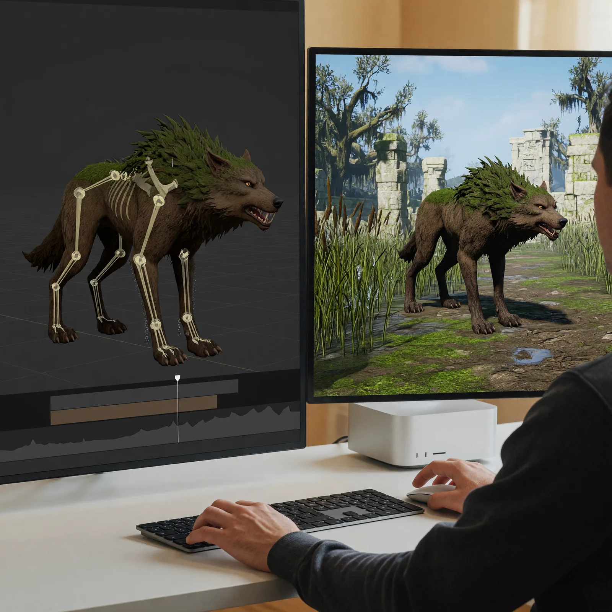
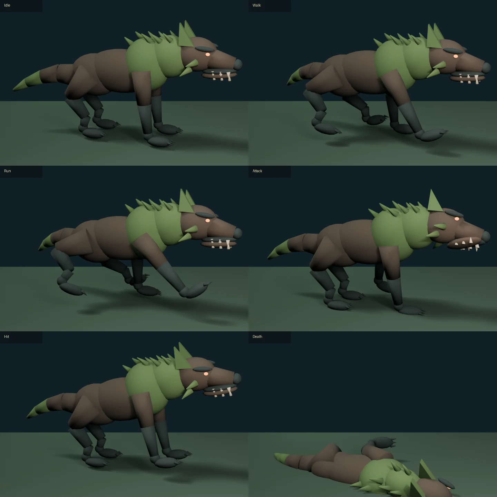
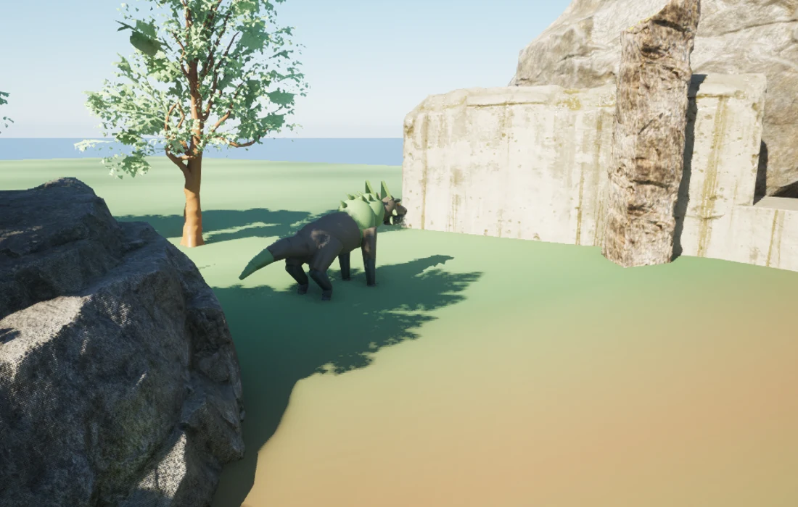

# Field Note: From Props to Predators: Building Embermere's First Animated Creature

Date: 2026-07-28



## Summary

The last time I wrote about Embermere, Codex and I had turned one Blender
waystone into a family of static roadside assets. The acceptance loop had
survived four model types, five Unreal placements, authored collision, package
persistence, route traversal, and a growing regression suite.

Yesterday we asked it to survive motion.

We built Embermere's first original creature: a rigged Marsh Prowler with a
project-owned skeletal mesh, 26-bone quadruped rig, five material roles, two
physics proxies, and six separate animation sequences for Idle, Walk, Run,
Attack, Hit, and Death. We replaced all three starter-enemy placeholders
without changing the combat, targeting, loot, quest, leash, death, or respawn
rules that already worked.

At the same time, we fixed a different class of visual problem across the
starter zone. Objects were not only missing grass around their feet. Sixty-seven
ordinary art actors were actually resting on an inherited `Z=20` convention
while the real foundation surface was `Z=0`. We grounded them, removed
unsupported geometry, built a project-owned moss-and-earth material with a
readable peat road, and added four non-colliding marsh reed clusters.

The larger lesson is that an animated game creature is not one artifact. It is
a chain of agreements between source geometry, rig, actions, FBX files, Unreal
packages, placed instances, runtime state, terrain contact, gameplay rules, and
human judgment.

## Observation

I am building Embermere as a Stylized Classic high-fantasy RPG with the feel of
early EverQuest and World of Warcraft. The Marsh Prowler began as a simple
direction: a dire-wolf silhouette with swamp colors, a mossy mane, mud-darkened
legs, amber eyes, and enough weight to feel dangerous without reading like a
boss.

I am doing the daily work in Codex with GPT-5.6 Sol Ultra and Fast mode. Codex
coordinates reviewed Blender scripts, the guarded localhost Blender MCP
bridge, Unreal Engine 5.8 through MCP, source and package validators, C++
runtime behavior, builds, and automation. I provide the creature direction,
gameplay intent, visual taste, hands-on play, and final acceptance.

Static props had already taught us to validate scale, pivots, UVs, materials,
collision, import provenance, package saving, and map placement. A creature
added several new questions:

- Does the skeleton deform the mesh cleanly?
- Do six valid Blender actions become six durable Unreal animation assets?
- Does the placed enemy actually retain the new visual after a restart?
- Does runtime state choose the right animation at the right moment?
- Do attack and death presentation preserve existing gameplay authority?
- Do the paws touch the real world surface at the normal camera distance?
- Does the whole combat, loot, quest, leash, death, and respawn loop still
  work?

Those questions turned one model build into an animation and runtime acceptance
pipeline.

## The First Marsh Prowler



*The six real project-owned Blender action previews. The sheet made motion
reviewable before any animation reached Unreal.*

The first pass deliberately stayed bounded:

| Contract | Accepted result |
| --- | --- |
| Render topology | 7,464 triangles and 3,878 vertices |
| Bind-pose dimensions | Approximately 414.734 x 104 x 209.5 cm |
| Transform and topology | Applied `1,1,1` scale, one UV channel, zero non-manifold edges |
| Material roles | Fur, mossy mane, mud-dark accents, amber eyes, and bone |
| Rig | 26 authored bones with a true root, spine, head, jaw, ears, tail, and four leg chains |
| Physics proxies | Two restrained authored shapes; the character capsule remains gameplay authority |
| Actions | Idle 1-49, Walk 1-33, Run 1-25, Attack 1-25, Hit 1-17, Death 1-41 |
| Unreal integration | One skeletal mesh, skeleton, physics asset, five materials, and six saved `AnimSequence` assets |
| World integration | Three saved starter-enemy instances using the new presentation |

The original brief suggested a 12,000-20,000 triangle target and three or fewer
materials. The accepted model landed below that triangle range and above that
material count. I kept it because the simpler 7,464-triangle silhouette read
clearly at Embermere's gameplay camera, while five small material roles gave
the peat, moss, mud, bone, and amber enough separation.

That was an important judgment call. A brief is a hypothesis about what the
asset will need. It is not a reason to add geometry after a cheaper model has
already passed the real visual and gameplay test.

## Six Animation Files Are Not A Living Enemy

Epic's FBX animation pipeline treats each imported animation as a distinct
sequence associated with a compatible skeleton. That made the export boundary
clear, but it did not decide when Embermere should play each sequence.

The generic enemy actor remained the behavioral authority:

| Runtime state | Presentation role |
| --- | --- |
| Standing at home or waiting between actions | Loop Idle |
| Chasing a target | Loop Walk |
| Returning home after a leash break | Loop Run |
| Landing the existing timed retaliation | Play Attack, then return to locomotion |
| Taking real damage | Play Hit without changing damage rules |
| Reaching zero health | Play Death, hide, then respawn through the existing timer |

The C++ boundary is intentionally small. Presentation observes the gameplay
state instead of becoming a second source of combat truth:

```cpp
void AEmbermereEnemyCharacter::UpdateVisualAnimation()
{
    if (!Stats || Stats->IsDead() || IsHidden())
    {
        return;
    }

    if (bMovedThisFrame)
    {
        PlayVisualAnimation(
            bReturningHome ? RunAnimation : WalkAnimation,
            true);
        return;
    }

    PlayVisualAnimation(IdleAnimation, true);
}
```

Attack, Hit, and Death use the same presentation function as one-shot
animations. The underlying character capsule, health component, attack cadence,
loot grant, quest progress, leash, and respawn timer remain asset-agnostic.
Another compatible enemy mesh and animation family can replace the Prowler
without rewriting those systems.

## The Animated-Asset Acceptance Loop

The static-prop loop grew into ten gates:

1. I defined the creature's role, silhouette, palette, gameplay scale, and
   camera-readability target.
2. Codex wrote a deterministic Blender build script under the project's
   reviewed script root.
3. The localhost-only Blender MCP bridge ran in Safe Mode with inline code
   disabled.
4. Blender checks measured topology, transforms, dimensions, UVs, materials,
   bone hierarchy, action names, frame ranges, and physics proxies.
5. Separate skeletal and animation FBX files crossed the engine boundary.
6. Unreal imported and explicitly saved the skeletal mesh, skeleton, physics
   asset, materials, and all six animation packages.
7. The Blueprint default and every placed enemy instance received the complete
   visual set.
8. Runtime state routed Idle, Walk, Run, Attack, Hit, and Death while existing
   gameplay rules stayed authoritative.
9. Clean PIE exercised targeting, Strike, retaliation, target clear, loot,
   hide, leash, death, and respawn.
10. A no-hot-reload Mac editor build, saved-package checks, and all 27 tests
    passed with no failures, skips, or warnings.

Each gate catches a different class of plausible failure. A clean action
preview cannot prove import persistence. A saved animation package cannot prove
that a map instance references it. A correct reference cannot prove that the
state machine chooses it. A passing state machine cannot prove that the paws
look grounded from the player's camera.

## The Failures That Made The Creature Real

### The Blueprint default was right while the world was wrong

The Marsh Prowler Blueprint's class default object held the new skeletal mesh
and six animation references. That looked like a successful integration.

All three starter-enemy actors already saved in the level still serialized
their inherited mesh component as `None`.

A Blueprint default does not automatically rewrite stale values already stored
on placed instances. We repaired the class default and each of the three saved
actors, saved both the Blueprint and map, then loaded them through a fresh
process and checked the complete visual set again.

That lesson applies well beyond character art. A correct template is not proof
that existing world instances inherited the correction.

### The floating problem was actual vertical placement

The gameplay capture made several objects look as though they needed grass or
ground texture around their bases. Better surface art would have improved
contact perception, but it could not close a real world-space gap.

In Unreal, vertical placement is the Z axis. The foundation top measured
`Z=0`, while 67 ordinary art actors inherited an old `Z=20` baseline. We
lowered the actors to the measured surface, removed two unsupported SoulCave
accents and three redundant enemy marker meshes, then validated the accepted
placements.

Only after geometry was grounded did we add the surface treatment:

- a texture-free 38-expression project-owned ground material;
- broad moss variation and a route-aligned peat path;
- a `300` cm path half width for clear village-to-wilderness navigation;
- four deterministic 1,012-triangle marsh reed clusters;
- explicit `NoCollision` on the decorative reeds.



*The real starter-zone result. Terrain contact, route readability, combat
space, and the creature's palette all had to work together.*

The distinction now lives in the project documentation: surface materials and
foliage can sell contact, but they must never conceal a measurable Z error.

### A live material graph was not a saved material graph

We also learned not to rebuild Unreal material graphs during PIE. One attempt
changed the live object but could not save the package. The in-memory graph
looked broken while the healthy 38-expression package still existed on disk.
A controlled restart recovered the durable asset.

Graph construction, package persistence, and live visual acceptance are three
separate gates.

### Component overrides did not repair vendor dependencies

Twenty-one KiteDemo tree and foliage placements needed project-owned component
material overrides to read correctly in the current map. That repaired the
visible level without modifying or redistributing raw vendor packages.

Fresh commandlets still reported some missing internal vendor references.
Those are separate truths: the current component presentation works, while the
underlying imported dependency graph remains incomplete and should eventually
be replaced by complete or project-owned art.

### Commandlets and PIE answered different questions

Fresh commandlets were authoritative for saved packages, serialized
properties, and map contracts. Native collision bodies and complete player
behavior required an initialized editor or PIE world.

We stopped treating either environment as universal proof. Package validators
must emit an explicit success marker with no `LogPython: Error`; collision,
movement, combat, and visual feel get separate live checks.

## Why It Matters

Rigging and animation are easy places to confuse activity with progress.
Seeing a creature move in Blender feels like a major finish line. In a game,
it is closer to the beginning of integration.

The Prowler had to survive at least four different representations:

- deterministic source and measurable actions in Blender;
- skeletal and animation interchange files;
- durable Unreal assets and map references;
- a living gameplay actor inside the actual starter zone.

Codex shortened the mechanical distance between those representations. It
wrote and reviewed scripts, built the asset, measured it, exported it, imported
it, wired the presentation, repaired persistence, ran validators, built the
editor, and exercised PIE. My role did not shrink. I made more frequent
decisions about silhouette, material balance, animation readability, route
clarity, combat feel, and whether the result belonged in Embermere.

This is the same human-AI collaboration pattern that emerged in the earlier
roadside family, now under more pressure. Deterministic contracts make output
eligible. Runtime evidence and human discernment make it part of the product.

Fab still gives Embermere valuable breadth. Blender and Codex are becoming the
identity lane for project-owned props and creatures. The goal is not to claim
that AI replaces character artists or animators. The goal is to build a
reproducible path where an original idea can become an inspectable, playable
asset and where specialist art can enter later without being coupled to
gameplay rules.

## What I Will Repeat

1. Keep the first creature bounded to one enemy and a complete gameplay loop.
2. Write the modeling, rig, animation, import, and runtime contracts before
   generating the final asset.
3. Export actions separately and verify every sequence against the intended
   skeleton.
4. Keep gameplay authority in asset-agnostic systems; let animation observe
   those systems.
5. Validate Blueprint defaults and every saved placed instance independently.
6. Save all generated Unreal packages explicitly, then reload them through a
   fresh process.
7. Measure terrain contact before adding grass, reeds, decals, or texture
   breakup.
8. Build material graphs outside PIE and treat the live object and disk package
   as separate states.
9. Use commandlets for persistence and initialized worlds for physics,
   movement, and play.
10. Accept the cheapest silhouette and material structure that reads clearly
    in the real camera and lighting.
11. Preserve the placeholder path until the original creature survives
    targeting, combat, loot, death, and respawn.
12. Turn every failure into a validator, automation test, or durable project
    lesson.

## Evaluation Ideas

- Can a clean checkout rebuild the Prowler from the reviewed Blender script?
- Do all six FBX actions import against the same compatible skeleton?
- Does a fresh process find the skeletal mesh, skeleton, physics asset,
  materials, animations, Blueprint defaults, and three map instances?
- Does each runtime state choose the intended loop or one-shot animation?
- Do one-shot animations complete without becoming combat authority?
- Does replacing the visual asset leave targeting, damage, loot, quest, leash,
  death, and respawn behavior unchanged?
- Do the paws remain grounded across Idle, Walk, Run, Attack, Hit, and Death?
- Does the creature remain readable at the normal third-person camera distance?
- Which brief constraints survive playtesting, and which should change because
  a simpler result already works?
- Can validators distinguish a correct Blueprint default from stale placed
  instances?
- Can the team distinguish a material-perception problem from a real transform
  error?
- Are package checks, physics checks, automation, and human play each answering
  a clearly named question?
- Does a new original creature improve Embermere's identity without coupling
  art to gameplay logic?

## Sources

- [From My Amiga 500 To Blender MCP: Building Embermere's First Original Asset](2026-07-14-amiga-blender-mcp-embermere.md)
- [From One Waystone to a World: The Acceptance Loop Behind Embermere](2026-07-22-embermere-asset-acceptance-loop.md)
- [Embermere RPG repository](https://github.com/disbitski/embermere-rpg)
- Embermere, [Marsh Prowler art brief](https://github.com/disbitski/embermere-rpg/blob/main/Docs/MARSH_PROWLER_ART_BRIEF.md)
- Embermere, [grounding and terrain pass](https://github.com/disbitski/embermere-rpg/blob/main/Docs/GROUNDING_AND_TERRAIN_PASS.md)
- Embermere, [Blender asset pipeline](https://github.com/disbitski/embermere-rpg/blob/main/Docs/BLENDER_ASSET_PIPELINE.md)
- Embermere, [Prowler and grounding implementation commit](https://github.com/disbitski/embermere-rpg/commit/8daafec2685252edc5a3e74e13a95981acdd16d8)
- Epic Games, [FBX Skeletal Mesh Pipeline in Unreal Engine](https://dev.epicgames.com/documentation/en-us/unreal-engine/fbx-skeletal-mesh-pipeline-in-unreal-engine)
- Epic Games, [FBX Animation Pipeline in Unreal Engine](https://dev.epicgames.com/documentation/en-us/unreal-engine/fbx-animation-pipeline-in-unreal-engine)
- Epic Games, [Skeletons in Unreal Engine](https://dev.epicgames.com/documentation/en-us/unreal-engine/skeletons-in-unreal-engine)
- Blender Foundation, [Actions](https://docs.blender.org/manual/en/latest/animation/actions.html)
- OpenAI, [Model Context Protocol](https://learn.chatgpt.com/docs/extend/mcp)
- [djeada/blender-mcp-server](https://github.com/djeada/blender-mcp-server)

## Working Principle

A rigged creature is not finished when six animations exist. It is finished
when source, skeleton, deformation, import, persistence, runtime state, terrain
contact, gameplay, and human judgment all agree.
