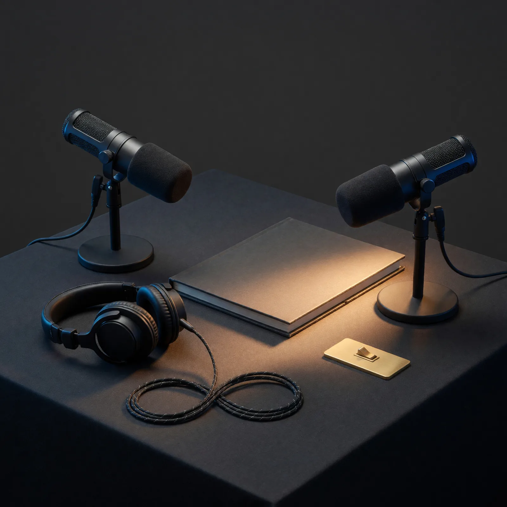

# Field Note: The Age We Build: When VoiceFirst Became A Human-AI Podcast

Date: 2026-08-02

## Summary

*The Age We Build* began as another way for people to learn from my Real World
AI Lab field notes. It became something more personal: a continuation of my
history with podcasts, conversational technology, developer education, and the
hopeful side of building with AI.

The show is organized around a simple promise: **HUMAN + AI + HOPE**.

Sophia and Marcus are AI-generated hosts. Sophia explores human meaning,
curiosity, and possibility. Marcus grounds the conversation in evidence,
implementation, and tradeoffs. Each episode begins with one of my field notes
and its sources, then opens into a wider forum of ideas.

Codex and I built the identity, website, provider comparison, host roles,
production rules, and launch experience together. AI helped us explore and
execute quickly. I chose the name, rejected work that did not feel right,
listened to complete episodes, and decided what was worthy of the show.

That division of labor became its own lesson: delegation can move the work,
but determination gives the work an identity.

## Observation

I have loved podcasts and worked in the medium since 2008. At Amazon, I
created, produced, published, and hosted both Alexa Dev Chat and the AWS
Developers Podcast. Podcasting let me do something I have always valued in
developer relations: bring technically deep people into a conversation and
make complicated ideas feel human, useful, and approachable.

That history shaped every decision about *The Age We Build*.

I did not want an automated summary feed with two interchangeable synthetic
voices. I wanted a real show identity, recurring hosts, a visual language,
conversational chemistry, room for ideas to breathe, and a point of view rooted
in hope without abandoning evidence.

The difference was visible in our first tests. Gemini gave us an automatable
two-speaker path and useful voice controls. NotebookLM gave us conversations
with more personality, chemistry, and natural movement. I chose NotebookLM in
two blind comparisons because I wanted to keep listening.

Quality, not automation or cost, made the decision.

## Why It Matters

Generative media can make it easy to produce something that looks or sounds
finished. That does not mean it has a reason to exist.

A durable show still needs:

- a point of view
- an audience promise
- recurring editorial roles
- recognizable sound and visual identity
- honest disclosure
- source boundaries
- taste strong enough to reject technically valid output
- a human willing to take responsibility for publication

The more capable the generation tools become, the more important those choices
feel. AI can create options at extraordinary speed. It does not remove the need
to decide what the work means.

## A VoiceFirst Thread Comes Full Circle

For six years, I was the Chief Evangelist for Alexa and Echo. My work sat at
the intersection of voice technology, developers, devices, community, and the
human habits that make conversation feel natural.

Alexa Dev Chat explored natural language understanding, voice recognition,
conversational design, and the builders creating new voice experiences. In
2018, I recorded an episode called *VoiceFirst in 2018, Where Are We Now?* We
were asking what happens when voice becomes a primary interface instead of an
accessory to a screen.

Years later, that question returned through Codex.

In [When Codex Left The Screen: My First Days With Codex Micro](2026-07-27-codex-micro-first-days.md),
I wrote about pressing a physical voice key and talking with GPT inside my
active coding thread. It did not feel like dictating a prompt. The pacing,
interruptions, clarification, tone, and back-and-forth made it feel like a
conversation about the thing we were building.

That was a VoiceFirst moment for me.

The programming language really could be English. An incomplete idea could
move through conversation into implementation. GPT could keep the project,
tools, and current work in context while I spoke naturally.

Starting an AI-native podcast at this moment felt well timed because voice has
crossed an important threshold in my own experience. The medium I have loved
for years and the conversational future I helped advocate for are meeting the
agentic systems I now use to build every day.

## Naming The Future We Wanted To Discuss

My early field notes documented a movement through fear, grief, and uncertainty
about AI toward curiosity, acceptance, and renewed excitement about what humans
can build with it.

I wanted the show name to carry that movement.

*The Age We Build* does not promise that abundance arrives automatically. It
says we still have agency. The future is not only something technology does to
us. It is also something people shape through the systems, norms, products,
stories, and boundaries we choose to create.

That is why the lockup became **HUMAN + AI + HOPE**.

Hope is not a substitute for criticism. It is a reason to stay engaged. The
show can talk about consciousness, automation, jobs, cost, safety, creativity,
and power without collapsing into either hype or despair.

## The Brand Had To Remember Where I Came From

Our first visual direction used a friendly robot, a human hand, and a sunrise.
The symbols made sense, but the result did not feel like my podcast history or
the kind of show I wanted to make.

I rejected it.

We went back to the visual language of the Alexa and AWS developer podcasts:
microphones, headphones, broadcast hardware, and conversation. The final
direction became a realistic black microphone framed by headphones, with a
warm sunrise glowing inside the grille and the headphone cable forming an
infinity loop.

Each object carries part of the story:

- the microphone and headphones connect the show to my history
- the sunrise makes hope the source of the signal
- the infinity cable suggests abundance and continued creation
- the black, cobalt, cyan, and solar-gold palette connects the show to my own
  visual identity

Codex and I then carried that identity into the cover art, favicon, social
assets, episode pages, transcripts, chapters, and
[podcast website](https://podcast.thedavedev.com/).

The website mattered because the show should feel like a place, not only an RSS
file submitted to directories.

## Designing Sophia And Marcus

The names came after the roles.

Sophia is the curious explorer. She notices the human meaning inside a
technical story and asks what the experience might change.

Marcus is the grounded builder. He tests mechanisms, evidence, boundaries, and
what someone could actually do with the lesson.

Together, they create a productive tension between wonder and rigor. Neither
host pretends to be me or claims my experiences as their own. They treat my
field note as source material and conversation starter.

We auditioned multiple Gemini voice pairings and selected Aoede and Sadaltager
as the fallback voices that best matched those roles. Then we compared complete
Gemini and NotebookLM versions anonymously.

NotebookLM won both completed comparisons.

The longer discussions were not automatically better because they were longer.
They were better because the hosts gave ideas enough room to connect, challenge
each other, and arrive somewhere that did not sound like a narrated outline.

NotebookLM does not expose stable Audio Overview voice IDs. Sophia and Marcus
are therefore editorial identities, not provider voice settings. We verify that
each downloaded Deep Dive has the recurring host sound before it reaches my
review. Aoede and Sadaltager remain the deterministic Gemini fallback.

That boundary protects the brand from a subtle mistake: confusing a provider's
voice implementation with the identity of the show.

## The Delegation And Determination Loop

Anthropic's AI Fluency framework uses Delegation, Description, Discernment, and
Diligence to describe effective human-AI collaboration. Those ideas map well
to what happened here.

I also found myself using another word: **determination**.

Discernment evaluates an output. Determination commits to what the work will
be. It includes taste, identity, willingness to reject a polished result, and
the final decision to publish.

| Human | AI and tools | Shared loop |
| --- | --- | --- |
| Mission, hope, history, taste, full listening, acceptance | Research, implementation, variants, source packets, audio candidates, verification | Describe, build, experience, critique, refine, and decide |

That loop showed up repeatedly:

- I rejected the first logo even though it satisfied the original prompt.
- We auditioned voices instead of accepting the first plausible pair.
- I chose NotebookLM only after blind listening, not from a feature table.
- A replacement trailer used the wrong format and host sound, so I scrapped it
  and kept the original.
- When an episode ended too abruptly, we designed a short sonic resolution and
  fade, listened again, and adopted it for the series.
- When factual review raised warnings, I listened to the complete conversation
  and decided whether the issue damaged the episode or simply deserved a
  documented caution.

The system accelerated my intent. It did not determine my taste for me.

## What I Should Watch

- Conversational fluency can make an unsupported claim feel more credible.
- A recurring AI voice can create attachment without being a person or having
  an inner life.
- Host chemistry should never override source fidelity or honest disclosure.
- A longer conversation should earn its length rather than repeat the source.
- Sophia and Marcus should open ideas beyond my experience without erasing the
  field note that grounds them.
- AI-hosted episodes should complement future human, guest, and interview
  formats rather than define the only way the show can grow.
- Brand consistency should not become a reason to resist better tools or new
  forms of conversation.

## Evaluation Ideas

- Can a listener describe the different editorial roles of Sophia and Marcus?
- Does an episode feel like a conversation rather than two voices reading a
  structured summary?
- Would I still choose the winning provider if the candidates were anonymous?
- Does the visual identity remain recognizable without readable text?
- Can the show express hope while taking technical and social risks seriously?
- Do the hosts distinguish my firsthand experience from their own analysis?
- Does every rejected asset teach us something that improves the next brief?
- Does Voice inside Codex help me develop interview questions and episode ideas
  differently from typing?
- After several episodes, do listeners want to hear another conversation with
  these hosts?

## Continue The Age We Build Journey

This note is about the voice, identity, and human-AI collaboration behind the
show. Its companion explains the production system that makes those choices
repeatable and reviewable.

- **Explore the production and review system:** [The Human Gate Behind An AI-Native Podcast Platform](2026-08-02-human-gate-ai-podcast-platform.md)
- **Hear the finished show:** [The Age We Build](https://podcast.thedavedev.com/)
- **See where VoiceFirst reached coding:** [When Codex Left The Screen: My First Days With Codex Micro](2026-07-27-codex-micro-first-days.md)

## Sources

- Amazon Alexa, [Alexa Dev Chat Podcast](https://developer.amazon.com/en-US/alexa/alexa-skills-kit/new/get-connected/developer-podcast)
- Amazon Alexa Developer Blog, [Announcing Alexa Dev Chat Podcast](https://developer.amazon.com/en-US/blogs/alexa/post/Tx48INC9Z2UW62/announcing-alexa-dev-chat-podcast-an-interview-series-with-the-community-and-teams-behind-alex)
- Amazon Alexa Developer Blog, [5 Years of Building for Voice with the Alexa Skills Kit, Alexa Voice Service, and Alexa Fund](https://developer.amazon.com/en-US/blogs/alexa/alexa-skills-kit/2020/07/5-years-of-building-for-voice-with-the-alexa-skills-kit-alexa-voice-service-and-alexa-fund)
- AWS, [AWS Developers Podcast](https://aws.amazon.com/developer/podcast/)
- Apple Podcasts, [Alexa Dev Chat](https://podcasts.apple.com/us/podcast/alexa-dev-chat/id1131682069)
- Apple Podcasts, [The AWS Developers Podcast](https://podcasts.apple.com/us/podcast/the-aws-developers-podcast/id1574162669)
- OpenAI, [Introducing GPT-Live](https://openai.com/index/introducing-gpt-live/)
- Google Gemini Notebook Help, [Generate Audio Overview in Gemini Notebook](https://support.google.com/gemininotebook/answer/16212820)
- Anthropic, [AI Fluency: Delegation](https://www.anthropic.com/ai-fluency/ai-fluency-delegation)
- Anthropic, [AI Fluency: Description-Discernment Loop](https://www.anthropic.com/ai-fluency/description-discernment-loop)
- The Age We Build, [Podcast website](https://podcast.thedavedev.com/)

## Working Principle

AI can generate the voices, options, and implementation, but a show becomes
human when people give it memory, meaning, taste, hope, and the determination
to decide what deserves to be heard.
