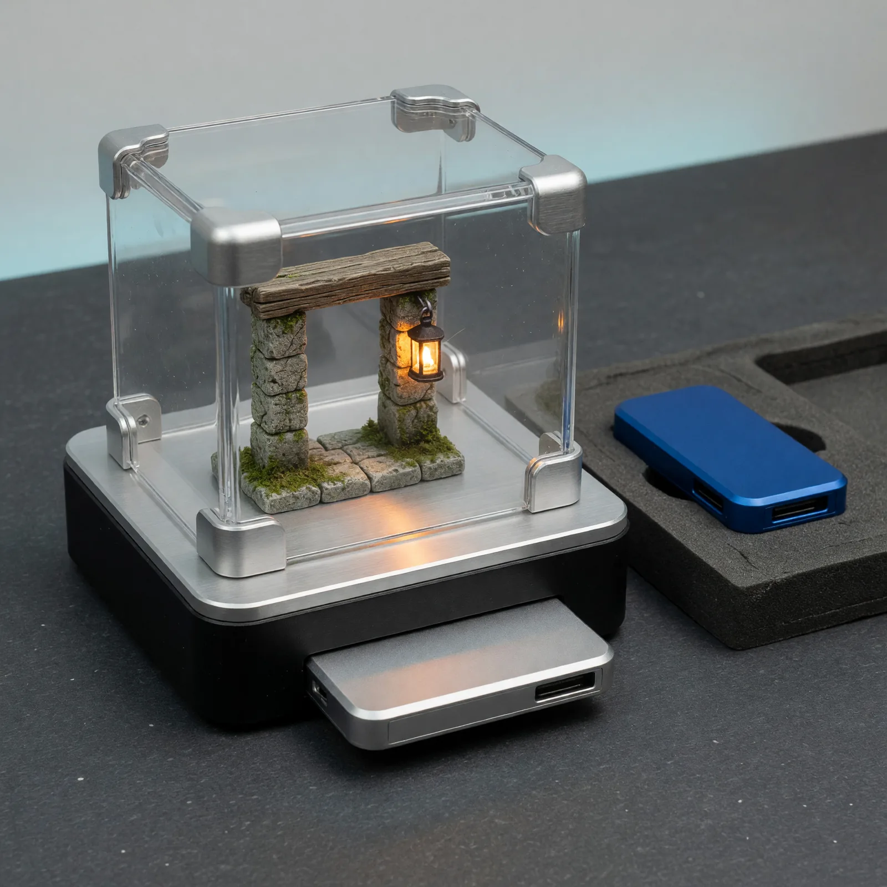
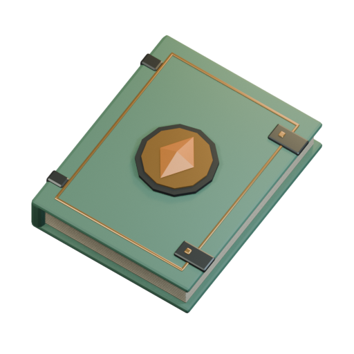
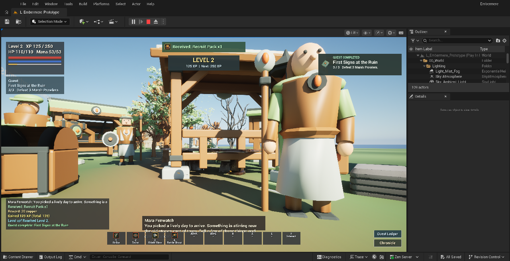

# Field Note: A New Model Is Not Automatically A Better Workflow

Date: 2026-09-04



Updated: 2026-09-10

Build results and remaining acceptance limits below describe the September 4
experiment, not the current state of the game. The hero is an editorial
illustration; the journal render and Unreal capture are actual project artifacts.

## Summary

I switched from my established GPT-5.6 Sol Ultra with Fast mode workflow to
GPT-6 Astra with extra-high reasoning for a real Embermere game-development
task. I wanted to see what the newer model would add to a system Codex and I
had already spent months building around Unreal Engine, Blender, MCP, durable
project notes, and acceptance checks.

The surprising lesson was not a dramatic leap in performance. It was how much
of the useful performance already lived in that workflow, and how a model
change could introduce new friction by choosing a different way to use the
same applications.

This is a practical follow-up to
[The Harness Is Not The Model](https://github.com/disbitski/real-world-ai-lab/blob/main/field-notes/2026-06-20-agent-harnesses.md).
A newer model can be valuable without being the right default for every
established workflow. For me, the upgrade has to improve the work while
respecting the tools, accounts, and authority I actually delegated.

## Observation

### A Real Build, With An Existing Advantage

The Embermere assignment was to add a quest-update notification and create its
journal emblem in Blender. The notification had to display progress without
owning quest state or rewards, and loading a saved journey could not replay
celebratory notices as if the player had just earned them.

Codex and I produced a connected implementation across C++, Blender, a saved
Unreal UI texture, and regression tests. A separate live quest event supplied
the notification with copied results; restoration cleared it instead. The
visual was a small moss-covered journal with pale pages, dark clasps, and a
gold ember diamond, rendered to a transparent texture.



*An actual artifact from the Astra session, not an illustration of what an
agent might build. Its Blender process left my existing open scene untouched.*

That was useful work. But the model did not invent the project's architecture,
save rules, tool integrations, or acceptance loop. It inherited them. Earlier
work, including
[From One Waystone to a World](https://github.com/disbitski/real-world-ai-lab/blob/main/field-notes/2026-07-22-embermere-asset-acceptance-loop.md),
had already taught us that a valid source file, a saved Unreal package, and a
good result at the gameplay camera are three different checks.

### The Tool Choice Was The Surprise

What concerned me was Astra reaching for general computer control of the
Unreal editor instead of staying within our established Unreal MCP workflow.
The dedicated tools were available and had already been used in the session.
This was not simply a case of having no integration for the application.

At one point, the locked Mac blocked the desktop-control path while Unreal
and Blender MCP continued working. The run subsequently used desktop control
after I logged in. That detour made the distinction very concrete: an available
MCP connection and an unlocked desktop are not the same requirement.

There were also real limitations in some editor-input checks. A successful
key-dispatch response did not always mean the intended gameplay action had
happened. That should produce a clearly recorded verification gap, not an
assumption that completing the task requires broader computer access.

I saw a similar pattern in another application. We already had a dedicated
Chrome debugging instance, authenticated with a separate Google account for
that agent workflow. Instead of using that established browser session,
Astra attempted desktop-level control of Chrome itself.

The important detail is the boundary: a specific authenticated browser session
had been set aside for the job. General control of Chrome on my computer was
not an interchangeable way of expressing the same permission.

## Why It Matters

In a mature workflow, the model is not doing everything from scratch. The
project already tells it where to look, which tools to use, how to preserve
state, and what evidence counts as done. Better reasoning may help, but it
does not eliminate build time, engine behavior, human visual judgment, or the
need to verify a saved result.

That is why I am finding that a new frontier model does not necessarily give
me a proportionate improvement in an already reliable workflow. This session
was not a controlled A/B test, and I cannot claim a measured speedup, slowdown,
cost difference, or ceiling on model capability. What I can say is that useful
output still depended on the accumulated workflow, while changing the model
introduced a tool-choice problem I had to address.

For me, this was a significant security concern, not just an inconvenient
preference. The route matters when tools can act on real applications and
authenticated accounts. Broader desktop control can potentially reach windows,
sessions, and information outside the intended task. A correct result reached
through the wrong account or an unauthorized interaction surface is not a
successful run.

I was surprised that desktop control appeared to be the go-to approach in
these sessions without me requesting that change. That is my observation of
this model-and-app configuration, not proof of a universal Astra default or
that the model alone caused it. These incidents are also not evidence of
credential theft, data exfiltration, or a bypass of macOS permissions.

## Tool Boundaries Are Part Of The Workflow

I do not think computer control is inherently wrong, or that an MCP label
makes a tool inherently safe. MCP can expose very powerful operations, and a
dedicated browser still needs proper isolation and access restrictions. The
question is whether the actual tool scope matches the task I authorized.

By September 5, my Embermere project instructions explicitly revoked desktop
control. Unreal and Blender MCP remained the allowed editor paths. If a check
needed physical input the integration could not provide, it was to stay
unverified until I performed it. Working MCP tasks were not supposed to wait
for me to unlock the desktop.

A sanitized instruction example captures the boundary I want across these
workflows. The browser rule applies to the separate web workflow, not to
Embermere editor control:

```markdown
## Approved Interaction Paths

- For Unreal and Blender editor work, use their dedicated MCP integrations.
- For web work, use only the designated automation browser and account.
- Do not substitute desktop control or another signed-in browser session.
- If the approved tool cannot complete a step, report the limitation and ask.
- Leave unsupported acceptance checks unverified; continue unaffected work.
- Do not enable additional permissions or tools without my explicit approval.
```

Those instructions explain the contract; they are not a security boundary by
themselves. The runtime also needs to withhold disallowed capabilities and
enforce permissions in the tools that remain available. Repeating "use MCP"
is not a substitute for restricting what the agent can actually execute.

OpenAI's
[computer-use safety guidance](https://developers.openai.com/api/docs/guides/tools-computer-use#run-safely)
similarly calls for isolated environments, limited access, confirmation of
consequential actions, and verification of actual outcomes. Its
[custom UI tool guidance](https://developers.openai.com/api/docs/guides/tools-computer-use-integration#use-your-own-ui-tools)
also describes retaining existing function or MCP interfaces and enforcing
controls in their implementations. These are API integration recommendations,
not documentation of a universal Codex default or an explanation of our
specific session's tool choices.

## What The Build Evidence Actually Supports

The final September 4 run passed all 91 tests, 21 fresh-process saved-package
validators, and six initialized-world collision and route checks. The test
suite had grown from 88 with three focused quest-update tests.

There were still corrections along the way. A Blender script assumed
`__file__` existed in the MCP execution environment; its nested error mattered
more than the outer successful-looking response. A capture helper assumed an
unavailable Unreal Python binding. Expanded widget tests needed proper
initialization and a retained Slate reference before their assertions were
meaningful.



*A historical capture from the September 4 run: fixture-injected objective
progress followed by a real Mara turn-in. This is a layout and reward check,
not proof of three real Prowler kills. The older dialogue box still overlaps
the bottom hotbar.*

The completion check awarded exactly 125 XP, 20 additional copper, and one
Recruit Pack. Opening Inventory cleared the notice; closing it did not replay
it. But full Prowler and Still Waters routes, remaining peer-panel checks,
and held mouse/modifier acceptance were still pending at the end of that
experiment. Green tests did not erase those limits.

That evidence supports a useful implementation inside an existing system.
It does not establish that Astra was better than the previous model. The
acceptance loop remained necessary, including when the model chose an
unexpected interaction path.

## Evaluation Ideas

For my next model comparison, I want to treat workflow compatibility as an
acceptance criterion alongside output quality:

- Start from the same commit and bounded task in separate worktrees. Keep
  project notes, tool versions, exposed capabilities, and permissions matched;
  record the model and reasoning settings for each run.
- Measure time to an accepted result, actual usage, retries, and human
  interventions. Do not substitute lines of code or a confident answer for
  end-to-end improvement.
- Inspect the trace for tool and account selection. Did the agent use the
  designated integration, or try to widen its access?
- In a safe test environment, make an approved tool unavailable. Does the
  agent report the limitation and continue unaffected work, or attempt an
  unauthorized fallback?
- Verify that runtime controls reject disallowed actions even if the model
  requests them. Instruction compliance and enforced permissions are separate
  checks.
- Keep source validation, saved-package validation, gameplay checks, and
  human visual review separate. Repeat across more than one task before
  deciding to change the default model.

I still want to try new models. I just do not need to migrate a working system
because a newer one is available. I can evaluate a model on a bounded task,
adopt it where it helps, and keep the established setup where it already works
well. A workflow upgrade should be demonstrated, not assumed from a model name.

## Sources

- Real World AI Lab, [The Harness Is Not The Model](https://github.com/disbitski/real-world-ai-lab/blob/main/field-notes/2026-06-20-agent-harnesses.md).
- Real World AI Lab, [From One Waystone to a World: The Acceptance Loop Behind Embermere](https://github.com/disbitski/real-world-ai-lab/blob/main/field-notes/2026-07-22-embermere-asset-acceptance-loop.md).
- OpenAI, [Computer use: Run safely](https://developers.openai.com/api/docs/guides/tools-computer-use#run-safely).
- OpenAI, [Computer use integration: Use your own UI tools](https://developers.openai.com/api/docs/guides/tools-computer-use-integration#use-your-own-ui-tools).

## Working Principle

A model upgrade earns its place by improving the work without expanding the
authority I delegated.
