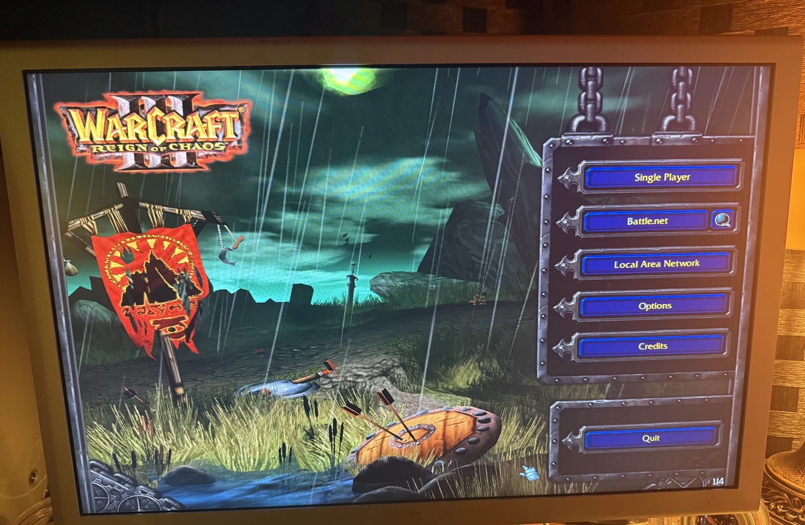
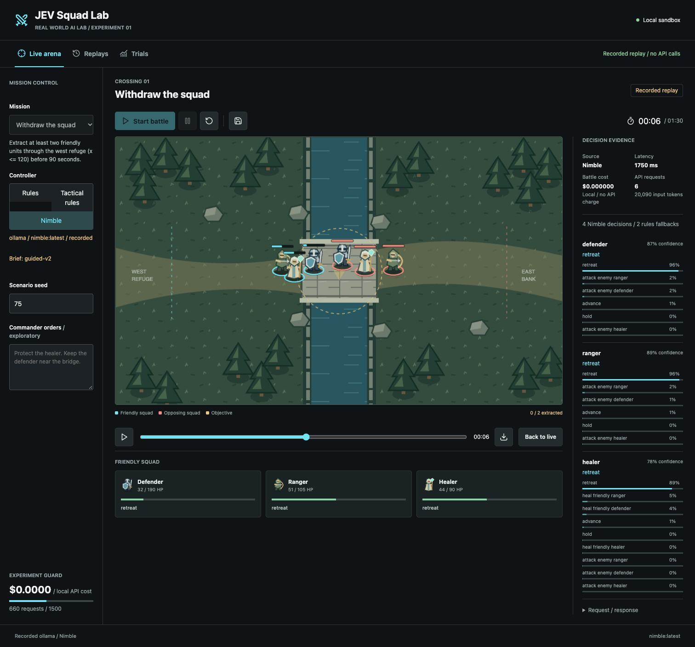
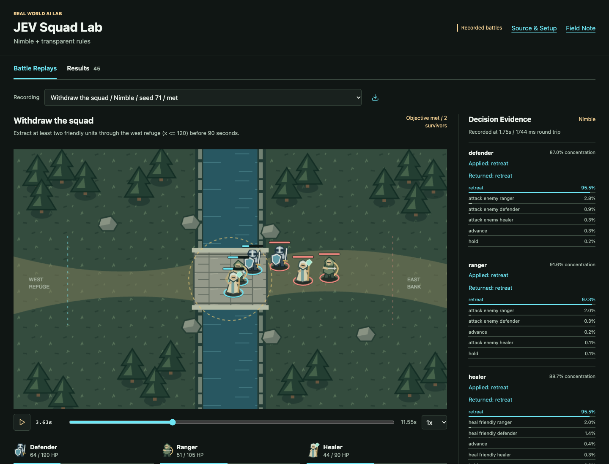
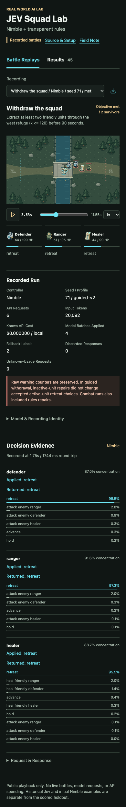
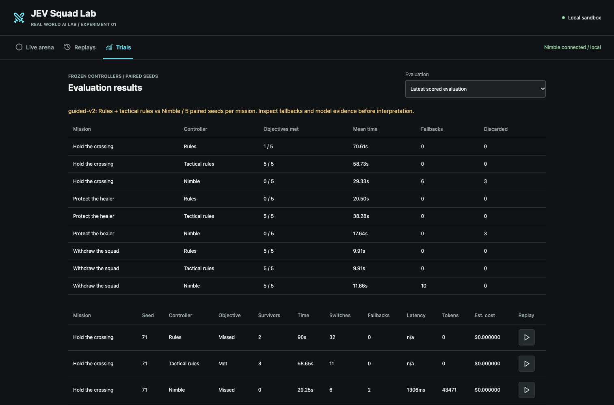

# Field Note: From Warcraft III To Jev And Nimble: Exploring AI That Chooses Instead Of Chats

Date: 2026-10-01


*My original Warcraft III setup. This is personal history, not a capture of our
AI experiment.*

## Summary

Warcraft III is one of my favorite games of all time. I still have a photograph
of it running on my original PC back in 2002, and another of it running on my
retro Power Mac G4 last year. Going back to those machines is not only about
nostalgia. It brings me back to the kinds of worlds and systems that made me
want to build things in the first place.

That made the idea behind Jev immediately interesting to me: what if an AI model
did not need to write a conversation about the next move, but could choose an
action that software could execute?

Codex and I built a small tactical sandbox to explore that question. Hosted Jev
gave us real responses, but not sustained access. A local route through Ollama
let us continue with **Nimble, a different decision model from Bespoke Labs**.
It is not Jev running on my Mac. The shared decision interface let us keep the
experiment while changing the model behind it.

The result was useful, but not the result I originally hoped for. Better
instructions helped Nimble complete our evacuation mission. They did not make
it a better combat controller than well-authored rules. The interesting lesson
became the difference between getting a decision, getting a useful decision,
and building a system that can tell those apart.



*Revisiting Warcraft III on my retro Power Mac G4. Neither Jev nor Nimble ran
on this machine.*

## Observation

TypeSafe's [Jev launch post](https://typesafe.ai/blog/introducing-system-one-models-and-jev)
describes models built for fast, structured decisions. Rather than asking for
an essay, software supplies state, a question, and allowed answers.

The Warcraft III connection that caught my attention came through
[wc3env](https://github.com/pwang724/wc3env), an independent project exposing
observations and commands for Warcraft III Legacy. It was inspiration, not our
implementation and not an official TypeSafe Warcraft demonstration.

I did not want our first experiment to involve modifying Warcraft, touching my
retro installations, or connecting another model to Embermere's Unreal editor.
We built an isolated, Mac-friendly game instead.

Then access became the first experiment.

Direct TypeSafe signup was waitlisted, so I joined the waitlist and funded the
[Vercel AI Gateway route](https://vercel.com/i/jev-integrations). Across ten scheduled exploratory battles, each battle
applied one genuine Jev decision batch and then fell back to rules. We recorded
53 HTTP 429 responses and three client-deadline timeouts across 66 attempts.

That was frustrating. It was also important not to overstate what it meant.
Successful responses established that some real access existed. They did not
establish usable sustained access for our workload. The error wording and
routing metadata did not conclusively identify whether the limit was enforced
at the gateway or upstream. These hybrid battles were not a valid benchmark of
Jev's tactical ability, and they did not prove deliberate false claims.

When I saw Ollama's decision-model support, we had a way to keep going.
[Ollama documents Nimble](https://ollama.com/library/nimble) as a 9B decision model
from Bespoke Labs, using a `/v1/systemone` endpoint compatible with TypeSafe's
interface. Our local runs used Nimble 9B Q8_0 on Ollama 0.35.0, on my M4 Max Mac
with 48 GB of memory. We recorded the observed model digest and configuration
hash; the `latest` tag itself is not an immutable version pin.

Local did not automatically mean smarter. It meant we could finally run the
decision loop repeatedly and inspect what happened.

## Why It Matters

There is a useful separation here between **planning what to do** and
**selecting the next action inside an existing plan**.

Codex and I designed the map, missions, code, observations, tests, and evaluation.
The decision model did not create a campaign strategy or invent a new game
mechanic. It answered bounded questions about the current battlefield.

That division is appealing. I can imagine using a larger reasoning model to
help define a strategy, then a specialized decision model to apply it in a
controlled loop. But that is a possible future architecture, not a result this
experiment proved.

The question I wanted answered was simpler:

> When does choosing among legal actions with a model add value beyond ordinary
> game AI?

The honest answer has to allow ordinary game AI to win.

## Our Sandbox Was Not Warcraft III

We built one crossing map in JavaScript, with Phaser rendering the battlefield
and Matter.js handling collision. Each side had a defender, ranged attacker,
and healer. The fantasy artwork was original, not extracted Warcraft assets.

The missions had explicit code-scored objectives:

| Mission | Objective |
| --- | --- |
| Hold the crossing | Accumulate 20 uncontested seconds near the bridge before the 90-second limit. |
| Protect the healer | Keep the healer alive through the limit, or defeat every opponent while the healer survives. |
| Withdraw the squad | Extract at least two injured friendly units through the west refuge before the limit. |

Code owned movement, collision, damage, healing, cooldowns, arithmetic, legal
actions, and scoring. The model received compact text state and one choice
question per active friendly unit, batched into a single request.

We allowed one request in flight, no more than one request start per second,
and a two-second deadline. Code revalidated returned orders before applying
them. A dead target, an extracted unit, an old run, or a response invalidated by
pause or reset could not become an action just because the model returned it.



*An actual sandbox replay, not a Warcraft capture. Playback uses saved state
snapshots and decision events, without calling a model again.*

The application remained loopback-only. Our local adapter sent no cloud key,
rejected remote origins and redirects, and could not silently fall back to paid
inference. Existing spending guards and the request ceiling remained in place.

My old PC and G4 photographs are personal context for why I wanted to try this.
Neither Jev nor Nimble ran on those retro machines.

## Try The Recorded Battles

I published the [Squad Lab source](https://github.com/disbitski/jev-squad-lab)
and an [interactive replay viewer on GitHub Pages](https://disbitski.github.io/jev-squad-lab/)
so readers can inspect the experiment rather than take my summary on faith.
The viewer includes all 45 scored battles, a
[downloadable results table](https://github.com/disbitski/jev-squad-lab/blob/main/replay/data/results.csv),
and three separately labeled historical examples. Original recordings remain
private; the public derivatives preserve the battlefield and decision evidence,
with checksums, while omitting account data and routing metadata.

A useful place to start is
[guided Nimble's withdrawal, seed 71](https://disbitski.github.io/jev-squad-lab/?replay=832e3d55-2c52-492a-a473-c8a58051e5c0).
For a combat comparison, watch
[tactical rules at the crossing on the same seed](https://disbitski.github.io/jev-squad-lab/?replay=4ad7c124-430c-4723-b338-daf59e4c45da)
alongside [Nimble's failed crossing run](https://disbitski.github.io/jev-squad-lab/?replay=fdcc7c4d-3c49-40fc-912e-197d3eafd661).
The Results tab links every scored row to its own recording.



*The public viewer displays saved evidence. Playback does not run the simulator
again or call a model.*



*The same recording and evidence are accessible on mobile. Live experiments
remain in the local source application.*

## What Changed When We Made The Tactics Explicit

The first frozen local comparison was not encouraging. Nimble completed none
of the five runs in any of the three missions. The original rules controller
completed all five withdrawal runs, but also failed the two combat missions.

I wanted to know whether we were asking the model to do something useful, not
merely proving that an endpoint returned JSON.

So we made the human tactical guidance clearer. Attackers should focus the
enemy ranger before the defender and healer. The crossing healer should support
the defender and move forward when nobody needed healing. Protecting the healer
made self-preservation explicit. During evacuation, everyone should retreat,
not stop to fight or heal.

We also changed the observation encoding: task-focused health, positions,
cooldowns, lifecycle flags, objective, and progress replaced a larger state
description. We removed previous-action labels after a separate static probe
showed they could change a returned choice. That probe did not establish a
general causal explanation for battlefield performance.

These were changes to our briefing and harness. **We did not train or update
Nimble's weights, and the model did not autonomously discover these tactics.**

We kept every legal action available. The model still had to choose; code did
not secretly substitute the action we hoped it would select.

For a more demanding reference, we also wrote a transparent tactical-rules
controller implementing the same human policy. The enemy, map, unit stats,
physics, and scoring stayed unchanged.

After exploratory tuning on separate seeds, we froze the controllers and ran
five fresh paired seeds per mission. Three controllers across three missions
gave us 45 recorded battles.

| Mission | Original rules | Tactical rules | Guided Nimble |
| --- | --- | --- | --- |
| Hold the crossing | 1/5 | 5/5 | 0/5 |
| Protect the healer | 0/5 | 5/5 | 0/5 |
| Withdraw the squad | 5/5 | 5/5 | 5/5 |



*The scored comparison. Earlier prompt variants remain separate, explicitly
unscored calibration records rather than extra wins pooled into this table.*

The evacuation improvement was real within this experiment: the initial
configuration missed all five withdrawal objectives, while the guided
configuration met all five fresh-seed objectives. But briefing, encoding, and
integration changed together, and the two series used different seeds. This
was not an isolated prompt-only test.

The tactical rules completed all 15 objectives and saved all three units every
time. Nimble saved two per withdrawal run and lost the defender. We have not
demonstrated a performance advantage for the model over that policy.

## A Real Decision, Not An Invented Explanation

Here is part of the actual first request from a scored withdrawal run. The
shared state began with:

```text
Commander policy: All friendly units retreat west. No fighting, healing or holding during evacuation.
Mission withdraw: Extract at least two friendly units through the west refuge (x <= 120) before 90 seconds.
Time 0s. Bridge held 0s. f- units are friendly; e- units are enemy.
```

The full state also included all six units' health, positions, cooldowns, and
lifecycle flags. This excerpt shows the ranger's exact question and criteria;
the other two unit questions are omitted for readability:

```json
{
  "model": "nimble:latest",
  "questions": {
    "f-ranger": {
      "type": "choice",
      "instructions": "Apply the commander policy to FRIENDLY ranger (f-ranger). Which action is required now?",
      "criteria": {
        "hold": "Stay idle without attacking; not ordered by commander policy.",
        "advance": "Occupy bridge without attacking. Healer advances when no allies need healing in crossing.",
        "retreat": "Retreat west. Required in withdrawal, or for uninjured healer in protect-healer.",
        "attack:e-defender": "Pursue and attack enemy defender: only after enemy ranger dies. For defender and ranger, not healer.",
        "attack:e-ranger": "Pursue and attack enemy ranger: first living enemy priority. For defender and ranger, not healer.",
        "attack:e-healer": "Pursue and attack enemy healer: only after enemy ranger and defender die. For defender and ranger, not healer."
      }
    }
  }
}
```

The returned ranger answer was:

```json
{
  "type": "choice",
  "choice": "retreat",
  "probabilities": {
    "hold": 0.0012042503153399035,
    "advance": 0.0019260316005179085,
    "retreat": 0.9729478628632342,
    "attack:e-defender": 0.002911215076967092,
    "attack:e-ranger": 0.01962215392726512,
    "attack:e-healer": 0.0013884862166759018
  },
  "confidence": 0.9162325383518525
}
```

The batch returned in 1,744 ms, reported 3,630 input tokens, and selected retreat
for all three friendly units. Code accepted all three orders. The run eventually
met the objective by extracting two units in 11.55 simulated seconds.

That is observable evidence. It is not a transcript of the model's reasoning.
[Ollama's documentation](https://ollama.com/library/nimble) explains that
confidence measures how concentrated the answer probabilities are, not the
chance that the answer is correct. I cannot turn that confidence value into a
claim that the ranger understood our strategy with 91.6% certainty.

## Reliability, Latency, And The Cost Of Experimenting

The frozen guided series made 158 local requests and reported 465,858 input
tokens. There were no HTTP throttles, client timeouts, or requests with unknown
usage in that scored series. Mean batch round-trip latency was 1,439 ms; p95 was
1,757 ms. Those are measurements of our actual integration, not a provider's
headline model-compute latency.

It still had integration warnings: 16 batches carried the existing fallback
label and six responses were discarded after a terminal state. In withdrawal,
the ten warning batches involved orders for units that had already died or
extracted. Accepted orders for active units remained Nimble's returned retreat
choices. We preserved the raw counters rather than making the results look
cleaner afterward. Combat runs also included rules repairs.

The world kept moving while inference ran. Immediate rules saved all three
units in withdrawal; the model controller saved two. That does not isolate
latency as the sole cause, but it makes latency part of the system I need to
evaluate, not a footnote I can ignore.

Local API charges were **$0**. My hardware, memory use, and electricity were not
free and were not costed here. The earlier hosted scheduled trials reported
about $0.000955 in known charges; 56 attempts returned no usage, so their actual
cost remains unknown. Our conservative budget reservations were not an invoice.

For this project, local inference's clearest advantage was control over
experimentation. We could iterate without another hosted throttle stopping the
battle. That is an availability finding about these two setups, not evidence
that local models are generally faster or better.

## What I Would Build On Next

If the policy is fixed and simple enough to write clearly in code, I should not
add a model merely to make the system feel more advanced. Our tactical-rules
reference demonstrated that directly.

The more interesting possibility is a natural-language interface to changing
intent: protect this unit, disengage now, or apply a different policy without
writing a new controller each time. We have not yet shown that flexibility
outperforming code. It deserves a separate experiment with its own success
criteria.

This connects back to [The Harness Is Not The Model](https://github.com/disbitski/real-world-ai-lab/blob/main/field-notes/2026-06-20-agent-harnesses.md)
and [The Best AI Workflow May Be A Team Of Models](https://github.com/disbitski/real-world-ai-lab/blob/main/field-notes/2026-07-09-best-ai-workflow-team-of-models.md).
The useful unit is not just a model name. It is the model, its observations,
the controller around it, the task, and the evidence I can inspect afterward.

The public demo is replay-only: choose a recording, play,
pause, and scrub. No live inference, API-key entry, or backend that spends my
credits. The local source application is where live experiments belong.

## Evaluation Ideas

- Change one element at a time: briefing, state encoding, or decision cadence,
  while keeping the same seeds and policies.
- Test changing natural-language orders on genuinely new situations, against
  a rules controller allowed to implement equivalent policies.
- Add equivalent artificial delay to rules control to distinguish latency
  effects from decision quality.
- Expand beyond slightly varied starting positions to new opponents, maps,
  and mission demands before claiming generalization.
- Record survivors and warnings alongside mission completion. Meeting the
  minimum evacuation objective is not the same as saving everyone.
- Keep tuning separate from evaluation and confidence separate from correctness.

## Sources

- TypeSafe, [Introducing System One Models & Jev](https://typesafe.ai/blog/introducing-system-one-models-and-jev).
- Vercel, [Jev integrations and TypeSafe-compatible API](https://vercel.com/i/jev-integrations).
- Ollama, [Nimble model and decision API documentation](https://ollama.com/library/nimble).
- Bespoke Labs, [Nimble source and evaluation repository](https://github.com/bespokelabsai/nimble).
- Independent inspiration, [wc3env](https://github.com/pwang724/wc3env).
- Experiment evidence: [source, reviewed recordings, and frozen controller hashes](https://github.com/disbitski/jev-squad-lab),
  [scored results](https://github.com/disbitski/jev-squad-lab/blob/main/replay/data/results.csv),
  and [interactive replay viewer](https://disbitski.github.io/jev-squad-lab/).
  Private originals retain the source checksums. Availability trials,
  calibration, and scored evaluation remain separate records.

## Working Principle

Give a model a clear decision boundary, then measure whether it improves the
system. A valid choice is not automatically a useful choice, and sometimes
the right answer is still ordinary code.
